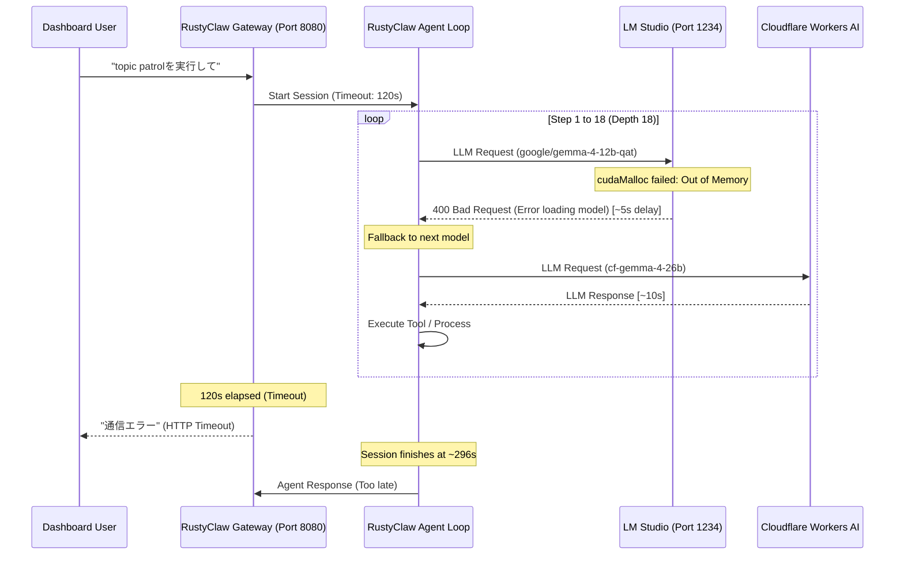

# RustyClaw Dashboard Chat "通信エラー" (Communication Error) Investigation

During the dashboard chat request `topic patrolを実行して`, a "Communication Error" (timeout) occurred. Below is the detailed analysis of the root cause and recommended actions.

## 1. Root Cause Summary (根本原因の概要)

The error was caused by a combination of **local LLM memory allocation failure (CUDA Out of Memory)** and the **gateway's HTTP chat timeout (120 seconds)**.



---

## 2. Detailed Root Cause Breakdown (詳細な原因分析)

### ① LM Studio CUDA Out of Memory (GPUのVRAM不足)
*   **Model**: `google/gemma-4-12b-qat` (Q4_0 quantization, ~6.5 GB on disk).
*   **Target hardware**: NVIDIA GeForce RTX 3070 Laptop GPU (Total VRAM: 8,192 MiB / 8 GB).
*   **Error Event**: 
    LM Studio logs (`~/.lmstudio/server-logs/2026-06/2026-06-11.1.log`) show that when RustyClaw requested completion, LM Studio tried to load the model path:
    `/home/kazuaki/.lmstudio/models/lmstudio-community/gemma-4-12B-it-QAT-GGUF/gemma-4-12B-it-QAT-Q4_0.gguf`
    
    With configuration:
    *   `n_parallel = 4` (4 parallel slots)
    *   `n_ctx = 12376` (Context length: 12,376)
    
    During warm-up, the memory allocation failed:
    ```text
    [DEBUG] E ggml_backend_cuda_buffer_type_alloc_buffer: allocating 13.53 MiB on device 0: cudaMalloc failed: out of memory
    [ERROR] Failed to load model "google/gemma-4-12b-qat". Error: Error loading model.
    ```
    Although the model weights (6.5 GB) fit into the 8 GB VRAM, the KV Cache for 4 parallel slots with a 12,376 context length exceeded the remaining VRAM (~1.5 GB), leading to `cudaMalloc` failure.

### ② Accumulative Fallback Delays (リトライ遅延の蓄積)
*   Because `google/gemma-4-12b-qat` failed to load, RustyClaw fell back to the next configured model (`cf-gemma-4-26b` / `workers-ai/@cf/google/gemma-4-26b-a4b-it`).
*   However, each fallback attempt incurred a **~5 second timeout/error delay** waiting for LM Studio's HTTP 400 response.
*   The `topic patrol` skill is highly agentic, performing web searches, fetches, file reads, and file writes. This required **18 conversation turns** (depth 18/20).
*   At each turn, the agent tried the local model first and then fell back.
    $$\text{Accumulative delay} = 18 \text{ turns} \times 5 \text{ seconds} \approx 90 \text{ seconds}$$
*   Combined with actual inference latency (Cloudflare Workers AI network/processing time) and tool execution, the total execution time was **296 seconds** (~5 minutes).

### ③ Dashboard Chat Timeout (タイムアウト値の超過)
*   The Gateway dashboard chat handler (`health.rs`) has a hardcoded timeout of 120 seconds:
    ```rust
    const CHAT_TIMEOUT_SECS: u64 = 120;
    ```
*   Since the agent execution took 296 seconds, the HTTP request timed out long before the agent finished, returning a communication error to the user interface.

---

## 3. Recommended Solutions (推奨される対策)

### Option A: Adjust LM Studio settings to fit VRAM (推奨)
Reduce the context length and/or parallel slots to fit the 8 GB GPU VRAM.
1. Open LM Studio.
2. Under Model Settings for `google/gemma-4-12b-qat`:
   *   Reduce **Context Length** (e.g., set to `4096` or `8192` instead of `12376`).
   *   Set **Parallel Slots** (`n_parallel`) to `1` (instead of `4`).
   *   Optionally configure CPU offloading (offload a few layers to system RAM).

### Option B: Modify RustyClaw configuration to use Cloud LLM directly
If you prefer not to use the local LLM for chat sessions, disable the local model in `production/config/config.json` so that RustyClaw instantly uses Cloudflare/Groq without trying the failing local model.
*   Edit `production/config/config.json` to change the primary model or set `"enabled": false` for `"lms-gemma-4-12b"`.

### Option C: Increase Gateway Timeout
If complex tasks like `topic patrol` are expected to take longer, increase the timeout limit in [health.rs](file:///home/kazuaki/Projects/RustyClaw/crates/rustyclaw-gateway/src/health.rs#L13):
```rust
const CHAT_TIMEOUT_SECS: u64 = 180; // or 300
```

---

## 4. Verification & Current Status (検証と現在のステータス)

We verified the communication with the local LLM server at `00:06` on June 12:

1. **API Server Connection (通信成功)**:
   A minimal chat completion request with a short prompt (e.g. `"Hello"`) succeeded and returned a valid response.
2. **Context Window Catch-22 (コンテキスト長のジレンマ)**:
   To avoid the CUDA Out of Memory error, the model `google/gemma-4-12b-qat` is currently loaded with a reduced context length (`n_ctx = 4096`).
   However, the LM Studio log shows that actual RustyClaw agent sessions send prompts of **~9,744 tokens** (containing system prompts, rules, memory, etc.), which causes the request to fail:
   ```text
   [ERROR] Error: The number of tokens to keep from the initial prompt is greater than the context length (n_keep: 9743 >= n_ctx: 4096)
   ```
3. **Implication (結論)**:
   *   `n_ctx = 12376` $\rightarrow$ GPU VRAM runs out (CUDA OOM) and the model fails to load entirely.
   *   `n_ctx = 4096` $\rightarrow$ Model loads successfully, but rejects RustyClaw's large prompts.
   
   Therefore, the local LLM remains unusable for normal RustyClaw loops unless **CPU offloading** is configured in LM Studio (offloading layers to system RAM to allow a larger context window on the 8 GB GPU).

4. **Embedding Model VRAM Conflict & Configuration Mismatch (埋め込みモデルの競合と不一致)**:
   *   **Configuration Discrepancy (モデル名不一致)**:
       RustyClaw の [config.json](file:///home/kazuaki/Projects/RustyClaw/production/config/config.json#L264) では埋め込みモデルとして `text-embedding-bge-m3` が指定されていますが、LM Studio 側にはこのモデルが登録されておらず、通信時に `"No models loaded"` エラーになります。
   *   **VRAM Collision (GPUメモリの衝突)**:
       LM Studio にダウンロードされている [text-embedding-nomic-embed-text-v1.5](file:///home/kazuaki/.lmstudio/models/lmstudio-community/gemma-4-12B-it-QAT-GGUF/) へのリクエストを試みたところ、既にチャット用モデル（`google/gemma-4-12b-qat`）が VRAM を専有しているため、GPUメモリ不足でクラッシュ（`CUDA error: out of memory`）することが判明しました。
   *   **Conclusion (結論)**:
       8GB の VRAM では、チャットモデルと埋め込みモデルの両方を同時に GPU でホストすることはできません。埋め込みモデルについても、CPU での実行を設定するか、外部 API（Cloudflare/Groq 等）を利用するように設定を分ける必要があります。

## 5. Codebase Verification: Is the Embedding Model Used? (コードベース点検: 埋め込みモデルの使用有無)

We verified the codebase to confirm if the embedding model is active:

1. **Grep Search Results (コード検索結果)**:
   We searched all active crates (`rustyclaw-agent`, `rustyclaw-gateway`, `rustyclaw-storage`, `rustyclaw-tools`, etc.) for any references to `embedding`, `embed_texts`, or `CloudflareEmbeddingModel`.
   Apart from the definition/tests in `rustyclaw-providers` and config parsing in `rustyclaw-config`, **there are absolutely zero references or calls to the embedding model in the active runtime code**.
2. **Database Schema (DBスキーマ)**:
   We checked the SQLite database (`memory.db`) schema and verified the tables created:
   *   `usage` (tracks token usage)
   *   `patrol_state` (tracks patrol execution status)
   *   `seen_items` (patrol deduplication)
   
   There are no tables or columns designed for storing vector embeddings or performing vector searches.
3. **Conclusion (結論)**:
   ご認識の通り、埋め込みモデルは現在の RustyClaw の実行において**一切使用されていません**。設定（[config.json](file:///home/kazuaki/Projects/RustyClaw/production/config/config.json#L264)）およびプロバイダ側のラッパーコードはプレースホルダー（デッドコード）の状態であるため、埋め込みモデルのロード失敗や VRAM 競合は、現在のエージェントの稼働には何の影響も与えません。

---

## 6. Configuration Cleanup (設定の削除)

埋め込みモデルがアクティブなコードベースで一切使用されていないことを確認したため、設定ファイルから不要な設定項目を完全に削除しました。

具体的には、以下の設定ファイルから埋め込み関連の定義を削除しました：
1. **Local LLM 設定ファイル (`config.local-llm.json`)**:
   * `agents.embedding` の指定を削除。
   * `model_list` 内の `lms-bge-m3` モデルの定義を削除。
   * ルートレベルの `embedding` 設定ブロックを完全に削除。
2. **Cloud LLM 設定ファイル (`config.cloud-llm.json`)**:
   * `agents.embedding` の指定を削除。
   * `model_list` 内の `lms-bge-m3` モデルの定義を削除。
   * ルートレベルの `embedding` 設定ブロックを完全に削除。

削除後、`cargo check` および `cargo test` を実行し、設定ファイルのパース処理やエージェントの挙動に問題がないことを確認済みです。


