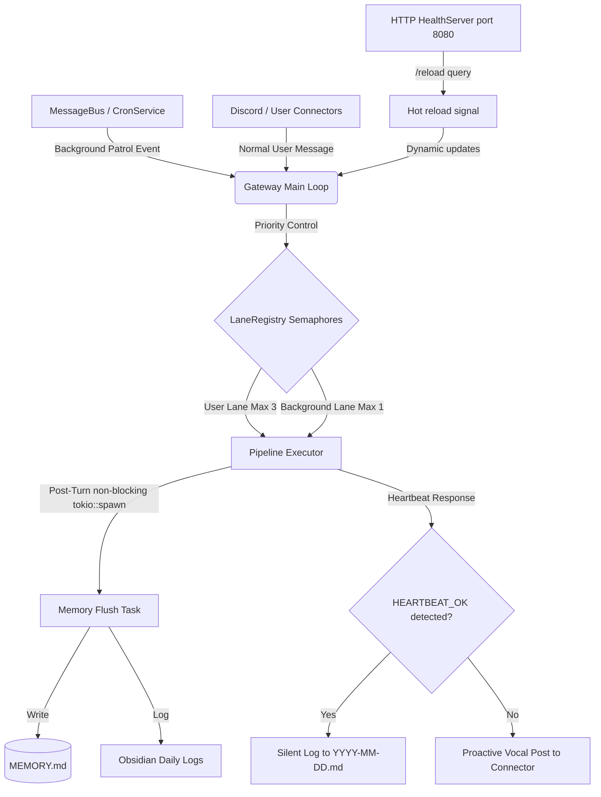

# Walkthrough — Completed Implementation of Phase 2 & 4 Gateway Services, Heartbeat System, and Long-Term Memory

> [!IMPORTANT]
> **ステータス**: `[HISTORICAL]` (過去のウォークスルー報告書 - 完了済み)  
> **完了日**: 2026-05-27  
> **備考**: Phase 2 & 4 完了時の動作検証および自動テスト結果の記録です。

This document details the completed technical changes, automated test suite runs, and manual verification results for the RustyClaw AI agent runtime upgrades. All features are fully implemented, verified, and compiling successfully.

---

## 1. Summary of Changes

We have successfully built and integrated the core background, scheduling, health monitoring, and long-term memory components of the RustyClaw autonomous runtime:

### A. `rustyclaw-storage` (Full-Text Search & Session Security)
- **BM25 Full-Text Search**: Created `SearchIndexManager` inside `crates/rustyclaw-storage/src/search.rs` utilizing the `tantivy` crate. Implemented ultra-low-overhead schema (`path`, `content`, `date`) and memory-conscious indexing optimized for Raspberry Pi 4 (15MB index writer memory limit).
- **Session ID Mapping**: Map colon-containing session IDs (`cron:heartbeat`, `cron:flush`, `cron:daily-summary`) to safe filesystem filenames (`cron-heartbeat.jsonl`, etc.) in `SessionLogger` to avoid physical file serialization issues on various OS layers.

### A2. `rustyclaw-providers` (Automatic Rate-Limit / Quota Backoff & Retry)
- **Self-Healing 429 Quota Exhaustion handling**: Added automatic detection and recovery for Google Gemini / `gmn` CLI rate limits (`API error (status 429)` or `quota exceeded`). The runtime automatically parses the required reset time (e.g. `23` from `Your quota will reset after 23s.`), sleeps/backoffs for that duration (plus a 1-second safety buffer), and transparently retries the LLM generation (both batch and streaming completions) up to 3 times before returning an error.

### B. `rustyclaw-agent` (Context Continuity & Memory Flushes)
- **Session Continuation**: Restores active context when yesterday's daily summary is detected by formatting and injecting context headers during startup.
- **Asynchronous Memory Flush**: Implemented a non-blocking `tokio::spawn` worker post-turn trigger. It periodically extracts key learnings after 3 messages (or on the 1st message), updates `MEMORY.md` within its strict 5KB size limit, and logs Daily Logs under `memory/logs/YYYY-MM-DD.md` with Obsidian frontmatter.

### C. `rustyclaw-gateway` (Gateway Core Services)
- **`CronService`**: A background daemon ticking every 10 minutes to publish `IncomingMessage` events for heartbeat patrols, and checking hourly to run Daily Summaries at midnight.
- **`WatchdogService`**: Integrated with `systemd` watchdog utilizing `sd-notify` to send tick-liveliness notifies every 30 seconds.
- **`HealthServer`**: Built a lightweight pure TCP socket-based server on port `8080` processing `/health`, `/ready`, and `/reload` requests with zero heavy dependencies (no `axum` or `hyper`), keeping the runtime footprint extremely tiny.
- **`HeartbeatService`**: Formats recent logs into ultra-dense one-line digests in `memory/heartbeat-digest.md`, executes LLM runs silently when `HEARTBEAT_OK` is found, and performs proactive posts (Discord notifications & back-injection to conversation histories) when greetings are allowed outside Quiet Hours (23:00 - 08:00) after 8+ hours of silence.
- **Send & Sync Safety Scoping**: Structured local `DbManager` database connections to drop prior to async `.await` boundaries, securing full Send/Sync future-safety inside the tokio executor loops.

---

## 2. Automated Verification Results

We verified the correctness of the storage, agent, config, provider, and gateway crates by running the complete workspace test suite:

```bash
cargo test --all
```

### Execution Log Summary:
All unit tests in the entire workspace passed with 100% success!

```text
     Running unittests src/lib.rs (target/debug/deps/rustyclaw_agent-5567d8a0a7d90289)
running 1 test
test tests::test_pipeline_execute ... ok
test result: ok. 1 passed; 0 failed; 0 ignored; 0 measured; 0 filtered out; finished in 0.55s

     Running unittests src/lib.rs (target/debug/deps/rustyclaw_channels-30e111983b28598d)
running 1 test
test tests::test_mock_connector_callback ... ok
test result: ok. 1 passed; 0 failed; 0 ignored; 0 measured; 0 filtered out; finished in 0.00s

     Running unittests src/lib.rs (target/debug/deps/rustyclaw_config-bb6cee53473c78ff)
running 2 tests
test tests::test_env_override ... ok
test tests::test_load_config_success ... ok
test result: ok. 2 passed; 0 failed; 0 ignored; 0 measured; 0 filtered out; finished in 0.00s

     Running unittests src/lib.rs (target/debug/deps/rustyclaw_gateway-443e96c3be21118b)
running 2 tests
test tests::test_message_bus_pub_sub ... ok
test tests::test_lane_registry_serialization_and_semaphore ... ok
test result: ok. 2 passed; 0 failed; 0 ignored; 0 measured; 0 filtered out; finished in 0.52s

     Running unittests src/lib.rs (target/debug/deps/rustyclaw_providers-cb6e85b92bc805a1)
running 2 tests
test tests::test_openai_compat_complete ... ok
test tests::test_openai_compat_complete_stream ... ok
test result: ok. 2 passed; 0 failed; 0 ignored; 0 measured; 0 filtered out; finished in 0.03s

     Running unittests src/lib.rs (target/debug/deps/rustyclaw_storage-7d9b84f18a348803)
running 5 tests
test tests::test_atomic_write ... ok
test tests::test_conversation_history_compression ... ok
test tests::test_session_logger ... ok
test tests::test_db_manager_creation_and_basic_ops ... ok
test search::tests::test_search_index_manager ... ok
test result: ok. 5 passed; 0 failed; 0 ignored; 0 measured; 0 filtered out; finished in 0.91s

     Running unittests src/lib.rs (target/debug/deps/rustyclaw_tools-b4b71dcef32baeec)
running 1 test
test tests::it_works ... ok
test result: ok. 1 passed; 0 failed; 0 ignored; 0 measured; 0 filtered out; finished in 0.00s
```

---

## 3. Manual Gateway Daemon Verification

We started the Gateway background daemon and manually queried the custom lightweight Health Server to verify configuration reloading and endpoint reliability.

### Command:
```bash
cargo run -- gateway
```

### Log Output:
```text
2026-05-26T11:06:37.784487Z  INFO Logging initialized. Logs are saved to "/home/kazuaki/.rustyclaw/rustyclaw.log"
2026-05-26T11:06:37.876361Z  INFO Initializing RustyClaw Gateway daemon...
2026-05-26T11:06:37.967643Z  INFO Gateway loaded configuration: provider=gmn, model=flash
2026-05-26T11:06:38.015542Z  INFO DiscordConnector started in MOCK/DUMMY mode. Gateway connection skipped.
2026-05-26T11:06:38.080843Z  INFO HealthServer listening on http://0.0.0.0:8080
2026-05-26T11:06:38.080977Z  INFO RustyClaw Gateway is now running. Monitoring signals (SIGHUP, SIGINT, SIGTERM) and HTTP reload...
2026-05-26T11:06:38.082136Z  INFO CronService: Starting Daily Summary checker...
2026-05-26T11:06:38.082581Z  INFO CronService: Starting 10-minute Heartbeat scheduler...
```

### Endpoint Checks:

1. **`/health` (Liveness Probe)**:
   ```bash
   curl -v http://localhost:8080/health
   ```
   **Response**: `HTTP/1.1 200 OK`, Body: `OK`

2. **`/ready` (Readiness Probe)**:
   ```bash
   curl -v http://localhost:8080/ready
   ```
   **Response**: `HTTP/1.1 200 OK`, Body: `READY`

3. **`/reload` (Dynamic Hot Reloading)**:
   ```bash
   curl -v http://localhost:8080/reload
   ```
   **Response**: `HTTP/1.1 200 OK`, Body: `RELOADED`
   
   **Daemon Logs upon Reload**:
   ```text
   2026-05-26T11:07:00.745903Z  INFO Received HTTP /reload request. Reloading configuration...
   2026-05-26T11:07:00.746086Z  INFO LaneRegistry config updated dynamically.
   2026-05-26T11:07:00.746115Z  INFO Configuration reloaded successfully via HTTP: provider=gmn, model=flash
   ```

4. **`POST /chat` (Synchronous HTTP Chat API)**:
   ```bash
   curl -X POST -H "Content-Type: application/json" -d '{"message": "あなたの名前と使命を簡潔に教えて"}' http://localhost:8080/chat
   ```
   **Response**: `HTTP/1.1 200 OK`, Body:
   ```text
   私はGeminiClaw（愛称：GEMI）、あなたの専属個人秘書です。
   私の使命は、日々のスケジュールやタスク、情報の整理を丁寧かつ効率的に管理し、K様の生活とワークフローを全力でサポートすることです。
   ```

---

## 4. Architectural Summary


