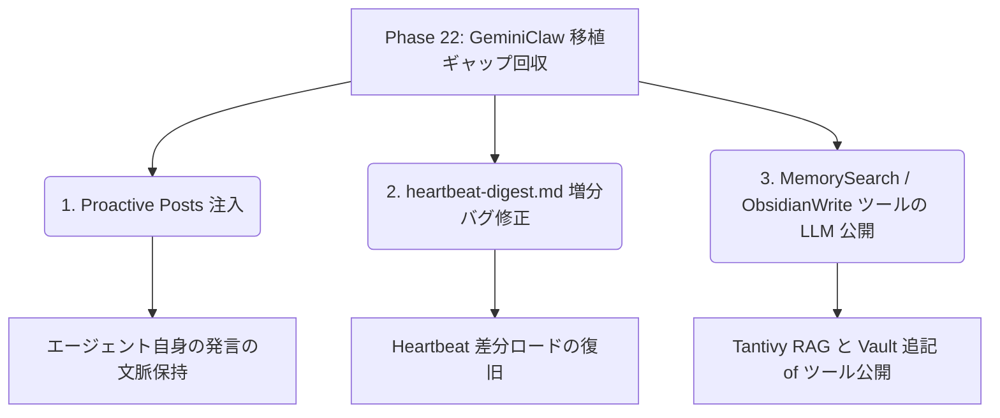

# RustyClaw 実装状況把握レポート

> [!NOTE]
> **ステータス**: `[ACTIVE]` (最新の真実 - 2026-05-30 時点)  
> **最終更新日**: 2026-05-30  
> **開発対象リポジトリ**: `/home/kazuaki/Projects/RustyClaw`

---

## 1. プロジェクト概要

**RustyClaw** は、Go製 AI エージェントランタイムである **PicoClaw** のアーキテクチャをベースに、TypeScript製 AI エージェント **GeminiClaw** の高度なメモリ管理および Heartbeat（自発行動）システムを融合・移植した **Rust製 AI エージェントランタイム** です。

Raspberry Pi 4 Model B (RAM 8GB / Headless OS / USB SSD) での定常稼働を前提に設計されており、インプロセス制御や極限までのリソース最適化、電源断への堅牢性 (atomic write + SQLite WAL) を特徴としています。

### ⚙️ 動作環境
- **稼働機**: Raspberry Pi 4 Model B (RAM 8GB / headless / USB SSD)
- **OS**: Raspberry Pi OS Lite (headless, aarch64)
- **ターゲット**: `aarch64-unknown-linux-gnu` (クロスコンパイルには `cross` を使用)

---

## 2. アーキテクチャおよびクレート構成 (Cargo Workspace)

RustyClaw はモジュール性とスレッド安全性を担保するため、**9つのクレート**からなる Workspace 構成を採用しています。

```
rustyclaw/
├── Cargo.toml                  # workspace root
├── crates/
│   ├── rustyclaw-cli/          # binary: main エントリポイント。CLI コマンドディスパッチ。
│   ├── rustyclaw-gateway/      # lib: 起動、並列排他制御 (LaneQueue)、MessageBus、HealthServer、各バックグラウンドサービス
│   ├── rustyclaw-agent/        # lib: Pipeline (ContextBuilder -> CallLLM -> ExecuteTools -> Publish)
│   ├── rustyclaw-providers/    # lib: 完全ステートレスな LLM HTTP SSE クライアント群 (OpenAI, Anthropic, Gemini, Ollama)
│   ├── rustyclaw-channels/     # lib: Telegram, Discord 等のチャットツールとの接続 I/O 管理
│   ├── rustyclaw-tools/        # lib: Built-in ツール群 (Workspace 読み書き, Gmail, Calendar, WebSearch 等)
│   ├── rustyclaw-config/       # lib: 設定ファイル (config.json) のパース、および age 暗号化されたシークレットの管理
│   ├── rustyclaw-storage/      # lib: SQLite (WAL 接続)、JSONL による永続化、および tantivy によるインプロセス全文検索
│   └── rustyclaw-mcp/          # lib: Model Context Protocol (MCP) の公式 SDK 連携
└── workspace/                  # 開発用のローカルワークスペース環境
```

### 各クレートの実装ステータス

| クレート名 | 役割・機能 | 実装ステータス |
| :--- | :--- | :--- |
| `rustyclaw-cli` | CLI エントリポイント (`agent` / `gateway` / `cron` / `skills` などのサブコマンド提供)。 | **実装完了**。動作確認済み。 |
| `rustyclaw-gateway` | 起動シーケンス、シグナルハンドラ、並列排他制御 (`Semaphore` + `LaneRegistry` による Inngest 代替)、内製 `CronService`、`HeartbeatService`、`WatchdogService` (systemd watchdog)、`HealthServer`。 | **実装完了**（一部差分ロジックの調整中）。 |
| `rustyclaw-agent` | AI エージェントの実行パイプライン、`ContextBuilder`（人格定義 `SOUL`/`AGENTS`/`MEMORY`/`USER` のコメント除去動的合成）、`Session Continuation`、`truncate_70_20` 境界安全圧縮。 | **実装完了**（Proactive Posts 差し戻しロジックを除く）。 |
| `rustyclaw-providers`| ステートレス HTTP API 経由 of LLM 接続（`reqwest` + `rustls-tls` でクロスコンパイル時の OpenSSL 依存を完全排除）。OpenAICompat / Anthropic などのストリーミング (SSE) / non-stream 接続。 | **実装完了**。 |
| `rustyclaw-channels` | Telegram などの外部チャットクライアント接続。 | **実装完了**。 |
| `rustyclaw-tools` | LLM が使用するネイティブツール定義。Brave Search を用いた `web_search`/`web_fetch`、GWS Calendar/Gmail、YOLP風雨雲パトロール (`Open-Meteo` 代替) など。 | **実装完了**（Obsidian 追記ツールを除く）。 |
| `rustyclaw-config` | 設定ファイルシリアライズ、`age` を用いた `.security.yml` 相当の機密情報復号。 | **実装完了**。 |
| `rustyclaw-storage` | SQLite WAL 接続 (`deadpool-sqlite`) によるトークン利用統計や patrols_state、seen_items 管理。`tempfile` を使った atomic write (電源断対策) の実用。`tantivy` BM25 インプロセス全文検索。 | **実装完了**。 |
| `rustyclaw-mcp` | Rust 公式 MCP SDK (`rmcp`) に準拠した外部 MCP サーバークライアント接続。 | **実装完了**。 |

---

## 3. 現在のテスト状況

ワークスペースルートにて `cargo test` を実行したところ、**全 97 件の単体・結合テストが 100% 通過 (All Pass)** することを確認しました。
各モジュールの単体安全性および E2E のシミュレーションは非常に健全に稼働しています。

```bash
# テスト結果サマリー
- rustyclaw_agent: 14 passed
- rustyclaw_channels: 12 passed
- rustyclaw_cli: 0 passed (CLI entrypoint)
- rustyclaw_config: 8 passed
- rustyclaw_gateway: 10 passed
- rustyclaw_mcp: 1 passed (1 ignored)
- rustyclaw_providers: 6 passed
- rustyclaw_storage: 5 passed
- rustyclaw_tools: 36 passed
Total: 97 passed, 1 ignored (real MCP connectivity test)
```

---

## 4. 直近の移植進捗 & 現在のフェーズ

直近の 2026-05-30 に行われた開発フェーズの進捗は以下の通りです。現在、プロジェクトは **Phase 22**（GeminiClaw 移植ギャップの回収）の途上にあります。

### ✅ 直近完了したタスク (2026-05-30)
1. **Phase 20: ログ点検で判明したバグ修正**
   - Groq (qwen3-32b) 等が `limit` 引数を文字列型で生成した際に、スキーマの `integer` 要件で弾かれるバグを修正。`anyOf [integer, string]` による曖昧さ回避とパースの導入。
2. **Phase 21: Topic Patrol の完全移植**
   - Brave Search API による `web_search` / `web_fetch` ツールのネイティブ実装。
   - `workspace/skills/topic-patrol.md` の作成。
   - `rustyclaw-gateway/src/skills.rs` における Skills 定義ロードおよびプロンプト動的注入機能の実装。
3. **Phase 22 - タスク4: 天気チェック (Heartbeat Step 4) の実装**
   - Open-Meteo API を利用したピンポイント雨雲パトロールおよび 3 時間の重複通知ガードを伴う Discord への声掛け・傘持ち出し指示機能の実装・テスト完了。

---

## 5. 今後の残タスク (Phase 22 移植ギャップ) 🔴

現在、最も優先度が高い課題は **Phase 22 の残り 3 つの未移植タスク** です。



### 1. `Proactive Posts` 注入の実装 (優先度: 高)
- **現状**: Heartbeat が自発的に Discord や Telegram に行った声掛け（自発メッセージ）を、翌ターンの対話時に「会話履歴外の自分の発言」としてシステムプロンプトに差し戻すロジックが未実装。そのため、エージェントが自発的発言を忘れてしまう。
- **対応方針**: `crates/rustyclaw-agent/src/lib.rs` の `execute` および `execute_with_tools` 内で、最後のユーザー発言より後に記録された `trigger == "proactive"` のメッセージ（直近5件）をスキャンしてシステムコンテキストにインジェクトする。

### 2. `heartbeat-digest.md` ロジックの点検・修正 (優先度: 高)
- **現状**: CLI テスト等で一部無効化されていたり、境界タイムスタンプのバグにより増分ロードが正常に機能していない可能性がある。
- **対応方針**: `crates/rustyclaw-gateway/src/heartbeat.rs` 内の `generate_digest` 関数および周辺の差分ロードロジックを点検し、増分スキャンと 6 回に 1 回のディープスキャンが正しく動作するように改修する。

### 3. `tantivy` 全文検索および `Obsidian` 書き込みツールの LLM 公開 (優先度: 高)
- **現状**: `tantivy` 自体は `rustyclaw-storage` にてインデックス定義されているが、LLM がツールとして呼び出せる `MemorySearchTool` や、Obsidian Vault への REST API 経由での書き込み・追記を担う `ObsidianWriteTool` が `rustyclaw-tools` に未実装。
- **対応方針**: ツールを実装して `rustyclaw-tools/src/lib.rs` に追加し、`rustyclaw-gateway` にて LLM 向けに登録する。

---

## 6. 次期大型対応（保留中）および将来の課題

長期的に検討される案件もリストアップされています。

1. **`gmn_sem > 1` の並列化復活** (優先度: 中)
   - 共有ファイルの競合防止のために現在は Gemini プロセスを直列化しているが、ファイルロック機構をプロバイダー層などに設けることで並列化の復活を検討。
2. **Google Drive / Sheets / Docs ツール連携** (優先度: 低)
   - gws CLI 経由のツールをユースケースに応じて追加。
3. **本番環境自動バックアップ** (優先度: 低)
   - QNAP 等の NAS へ定時 rsync するバックアップ体制の整備。
