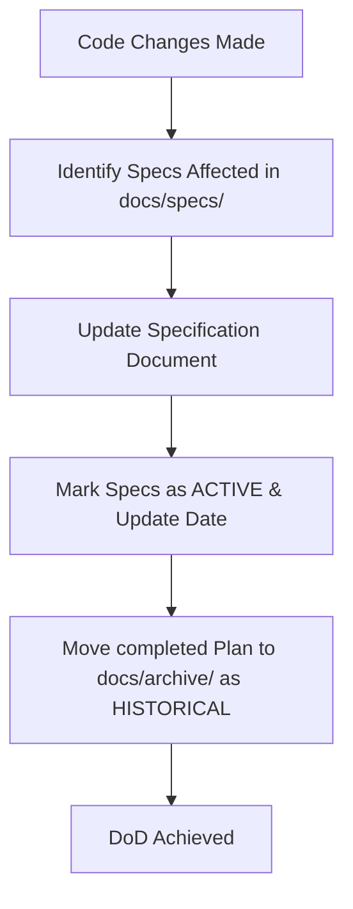

# RustyClaw Development & Deployment Environment Report

We have completed the inspection and walkthrough of the RustyClaw development specifications described in `docs/README.md`. Below is the consolidated overview of the architecture, workspace mapping, build system, deployment mechanisms, and development best practices.

---

## 🏗️ 1. Host Target & Environment Mapping

RustyClaw operates in a local/NAS hybrid environment with cross-compilation target:

### Host Machine Specs
- **Target OS / Arch**: Linux on a Raspberry Pi 4 (`aarch64`).
- **Connection Alias**: `rp1` (configured via `~/.ssh/config`).
  - *mDNS Host*: `RaspberryPi.local`
  - *Static LAN IP*: `192.168.1.12`
- **User & Privileges**: `kazuaki`, with passwordless `sudo` setup.
- **Service Manager**: `systemd` (runs as a user/system unit `rustyclaw.service`).

### Production Directory Mapping
On the Raspberry Pi 4 (`rp1`), production files are mapped as follows:

| Path | Purpose | Notes |
|---|---|---|
| `~/.local/bin/rustyclaw` | Executable Binary | Stored locally on the RPi4 to avoid issues when replacing running binaries. |
| `~/.rustyclaw` | Production Root Directory | Symbolic link to `~/Projects/RustyClaw/production` (mounted via NAS share, shared with the dev machine). |
| `~/.rustyclaw/config/` | Config & Credentials | Contains `config.json` and the encrypted secrets vault `vault.enc`. |
| `~/.rustyclaw/workspace/` | Runtime Workspace | Contains `*.md` personality configs, dynamic scheduler rules `cron.json`, long-term memory folder `memory/`, and runtime database `memory.db` (SQLite). |
| `~/.rustyclaw/logs/` | Application Logs | Console outputs and structured logs. |

---

## 🛠️ 2. Build & Deployment Flow

RustyClaw utilizes standard cross-compilation rather than heavy Docker containerization:

### 2-1. Target Setup (One-time)
```bash
rustup target add aarch64-unknown-linux-gnu
# Ensure aarch64-linux-gnu-gcc is installed (e.g. gcc-aarch64-linux-gnu package on Debian/Ubuntu)
```

### 2-2. Cross-Compilation Command
```bash
CARGO_TARGET_AARCH64_UNKNOWN_LINUX_GNU_LINKER=aarch64-linux-gnu-gcc \
  cargo build --release --target aarch64-unknown-linux-gnu -p rustyclaw-cli
```

### 2-3. Deploy Execution (Automated)
```bash
./scripts/deploy.sh
```
This automated script handles:
1. Triggering the cross-build of the cli/gateway targets.
2. Renaming the output to `production/bin/`.
3. Transferring the binary securely to `rp1:~/.local/bin/rustyclaw.new` (to avoid `ETXTBSY` busy file errors).
4. Stopping `rustyclaw` systemd service.
5. Swapping `rustyclaw.new` to `rustyclaw` atomically and updating executable permissions (`chmod +x`).
6. Starting/restarting `rustyclaw` service.

---

## 🧪 3. Verification & Diagnostic Commands

### 3-1. Dry Run / Clean Local Verification
To test changes safely without incurring actual LLM provider costs or depending on live Discord/Vault configurations, use the `--no-agent` flag:
```bash
rustyclaw --config /tmp/verify/config.json --workspace /tmp/verify/workspace --no-agent gateway
# Verify endpoint response
curl -s http://127.0.0.1:8080/api/concurrency
```

### 3-2. Service Monitoring on `rp1`
```bash
# Service management
ssh rp1 'sudo systemctl status rustyclaw'
ssh rp1 'sudo systemctl restart rustyclaw'

# Log tracing
ssh rp1 'journalctl --user -u rustyclaw -f'
```

---

## 📚 4. Documentation Lifecycle & DoD (Definition of Done)

Whenever any code updates or plans are implemented, the following strict workflow must be adhered to:



### Statues Tag Standards
- **`[ACTIVE]`** inside `/docs/specs/`: This represents the absolute, current truth of the codebase. It must match the current Rust/JS code 100% and have its "Last Updated" date updated at each edit.
- **`[HISTORICAL]`** inside `/docs/archive/`: Read-only, archived implementations, design thoughts, and logs of past phases. No future modifications allowed on these files.
