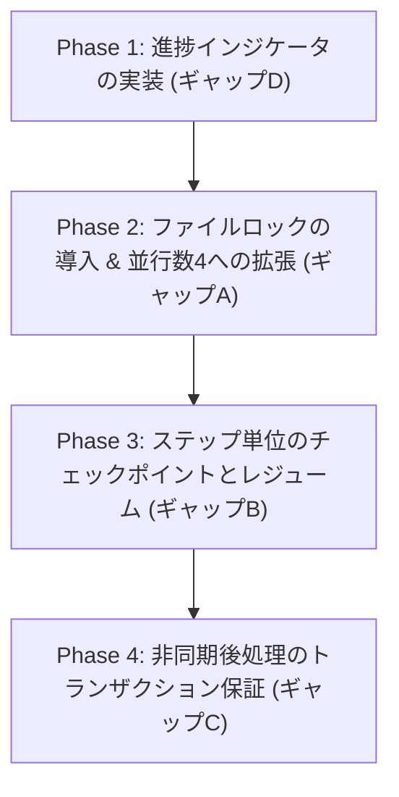

# GeminiClaw と RustyClaw の機能ギャップ分析：Lane Queue とプロセス管理

本ドキュメントは、**GeminiClaw** が採用しているイベント駆動型外部オーケストレーター **Inngest** による実行管理と、**RustyClaw** が採用している**自前管理（Tokio、mpsc チャンネル、セマフォ）**のアーキテクチャを比較し、機能および挙動上のギャップを洗い出した分析・計画書です。

---

## 1. 背景とアーキテクチャの対比

### GeminiClaw (Inngest 依存)
* **オーケストレーター**: Inngest プラットフォーム（ローカルまたはクラウドのデーモン）。
* **実行管理の特徴**: 
  - `step.run()`、`step.sleepUntil()`、`step.sendEvent()` などの関数を用いて実行を細分化。
  - Inngest が各ステップの実行状態や戻り値を永続キャッシュするため、途中でシステムがクラッシュしたりネットワークエラーが発生したりしても、**失敗したステップからピンポイントで復元・再試行（Lossless Resume）**が可能。

### RustyClaw (自前 Tokio & セマフォによる制御)
* **オーケストレーター**: Rust の **Tokio** ランタイム、`LaneRegistry` アクター（mpsc チャネル）、およびインプロセスの `tokio::sync::Semaphore`。
* **実行管理の特徴**:
  - `Pipeline::execute_with_tools` という巨大な `async` 関数内で、コンテキスト構築、LLM 呼び出し、ツールのループ実行、ログの書き込み、応答の生成までを一本の流れとして同期・直列的に実行。
  - メモリ上（Tokio タスク内）でのみ状態が保持されるため、途中で再起動やクラッシュが発生すると実行状態は完全に失われ、再試行時は最初から（高価な LLM API 呼び出しを含めて）やり直しになる。

---

## 2. Lane レベルの直列化とキューイング

両者ともに、同一セッション（チャンネルやユーザー）における並行処理による競合（Git のコンフリクトやデータベースのデッドロック）を防ぐため、**Lane Queue（セッション直列化）**のパターンを実装しています。

| 機能項目 | GeminiClaw (Inngest) | RustyClaw (自前 Tokio) | ギャップと現状評価 |
| :--- | :--- | :--- | :--- |
| **セッションごとの直列化** | **Inngest の Concurrency で制限**: `scope: 'fn'`, `key: 'event.data.sessionId'`, `limit: 1` で完全に直列キューイング。 | **`LaneRegistry` で実現**: セッション ID ごとに `mpsc::channel` を生成し、イベントを受信したワーカースレッド（Tokio タスク）が順番に消化。 | **ギャップなし ✅** RustyClaw 側も極めて安定したアクターモデルで直列化を実現しています。 |
| **バックグラウンド処理のキュー制限** | Inngest のキューでそのまま順番に実行。 | **独自ロジック搭載**: Background / Cron 優先度の低いタスクについて、古い未実行のキューをすべて読み捨てて最新の1件のみ実行する仕組みを実装済み。 | **ギャップなし ✅** RustyClaw の自前実装がむしろ実用的に最適化されています。 |

---

## 3. 洗い出された4つの機能ギャップと解決方針

Inngest の持つ強力なキューイング機能を、RustyClaw の自前インプロセス環境で同等に再現するために、以下の4つのギャップが特定されました。

### ギャップA：グローバル並行実行の制限とファイルロック (Global Concurrency & File Locking)

* **GeminiClaw**:
  - 同一セッションは直列化（limit: 1）しつつ、システム全体では**最大 4つまでの異なるセッションを同時に並行実行可能**（global limit: 4）。
* **RustyClaw**:
  - グローバルセマフォ `gmn_sem` の容量が **`1`** に固定されており、システム全体でいかなるセッションであっても同時に1つしか実行されない。
* **ギャップの本質**:
  - なぜ RustyClaw は 1件に制限しているかというと、`MEMORY.md`、`USER.md`、Tantivy インデックス、SQLite データベース（`memory.db`）などのワークスペースファイルに対して、複数セッションから並列に書き込みが発生した場合のデータ競合・上書き破損を防ぐため。
  - しかしこの制限により、1つのチャンネルでエージェントが重いツール実行や LLM レスポンスを待っている間、他のチャンネルや Cron / Heartbeat のタスクがすべて「Waiting（待機中）」となり、システム全体のレイテンシが悪化する。
* **解決方針**:
  1. `MEMORY.md` や `USER.md` などの共有ワークスペースファイルに対する書き込み時に、**ファイルロック（`fd-lock` や `fs2` などのクレートを使用）**またはセッション単位のインプロセス `RwLock` を導入する。
  2. セッションを跨いだ並列書き込みの安全性を確保したうえで、`gmn_sem` の容量を **`4`** に引き上げ、GeminiClaw 同等の並行スケーリングを実現する。

### ギャップB：ステップレベルでの実行中断・レジューム (Step Checkpointing & Lossless Resumes)

* **GeminiClaw**:
  - `step.run('check-resume')` -> `build-context` -> `run-gemini` -> `post-run` -> `deliver` と細分化。
  - 最後の `deliver`（チャネルへの応答送信）で Discord や Slack の API が一時的に落ちて失敗した場合、**LLM の呼び出し結果はキャッシュから復元され、`deliver` ステップのみがリトライ**される。
* **RustyClaw**:
  - `Pipeline::execute_with_tools` はモノリシックな同期実行。
  - Discord への送信時などの最終段階で通信エラーが発生した場合、全体がエラーとなり、リトライ時は **LLM API をもう一度呼び出すところからやり直し**になり、無駄な API コストと実行時間がかかる。
* **解決方針**:
  - パイプライン実行を「コンテキスト構築」「LLM/ツール実行」「後処理/メモリフラッシュ」「応答送信」などの個別フェーズに構造化する。
  - セッションフォルダ内に軽量な状態永続化ファイル（例：`pipeline_state.json` または SQLite の状態管理テーブル）を設け、各ステップ完了時の中間データをチェックポイントとして保存。
  - 失敗からの復帰時には、このチェックポイントから状態をロードして途中から処理を再開（Resume）するロジックを `rustyclaw-gateway` または `Pipeline` 内に実装する。

### ギャップC：応答送信と後処理の非同期・並行化 (Parallel Completion & Delivery)

* **GeminiClaw**:
  - `post-run`（メモリフラッシュ：ACP処理を含むため30〜90秒かかる極めて重い処理）と `deliver`（ユーザーへのメッセージ送信）を `Promise.allSettled()` で並行実行。
  - ユーザーはメモリ整理を待つことなく、LLM の回答を即座に受け取ることができる。
* **RustyClaw**:
  - `execute_with_tools` は、LLM ループ終了時に非同期で `self.trigger_memory_flush_async(...)` を呼び出して `tokio::spawn` でバックグラウンド処理として切り離し、即座に呼び出し元へ戻る実装になっている。
  - メモリフラッシュは容量 1 の `flush_sem` を取得して実行されるため、後処理同士の競合も防がれている。
* **ギャップの本質**:
  - すでに RustyClaw は非同期・非ブロッキングでのメモリフラッシュを実現しているため、動作上の顕著なギャップはない。
  - ただし、非同期にトリガーされた `flush_memory` がクラッシュ等で失敗した場合の「トランザクション的な再試行」や「エラーハンドリングの Gateway への伝搬」がない。
* **解決方針**:
  - 非同期メモリフラッシュの生存と結果を SQLite 等のデータベース側でトラッキングできるようにし、未完了のフラッシュが存在する場合はシステムの再起動時等にクリーンアップ・再試行を実行するリカバリ機構を整備する。

### ギャップD：進捗ステータス・タイピング通知 (Progress Indicators / Typing Status)

* **GeminiClaw**:
  - 実行中に `ChatProgressReporter` を生成し、LLM の思考中やツール（ファイル閲覧、コマンド実行など）をループで処理している最中、Discord 側に「タイピング中...」のステータスや「ツール `view_file` を実行中...」といった進捗メッセージを動的に送信・更新。
* **RustyClaw**:
  - プロンプトを Gateway が受け取ってから、エージェントが最終的な回答を生成するまで、Discord などのチャネル側は無音のまま数秒〜数十秒待たされる。ユーザーから見ると、システムがフリーズしているのか動作中なのか判別しにくい。
* **解決方針**:
  - `rustyclaw-channels` に `ProgressReporter` トレイト（タイピング状態の開始・終了、中間進捗の送信など）を定義。
  - `Pipeline::execute_with_tools` の引数にコールバック `on_event: Option<Arc<dyn ProgressReporter>>` を渡せるように拡張。
  - LLM の完了やツール実行開始のフックポイントで進捗イベントを呼び出し、チャネル側でリアルタイムにタイピング表示や進捗アップデートを通知する。

---

## 4. 今後のロードマップ案

本ギャップ分析に基づき、以下のステップで RustyClaw のプロセス・キュー管理機能を強化していきます。

### ステップ 1: 進捗インジケータの実装（優先度：高）
ユーザー体験（UX）に直結するため、まずは `ProgressReporter` インターフェースを定義し、Discord チャネルに「タイピング中...」や「ツール実行中」のフィードバックを返す仕組みを統合します。

### ステップ 2: ファイルレベルの排他ロックと並行実行（容量4）の開放（優先度：中）
並行実行時のデータ破壊を防ぐため、`MEMORY.md` や `USER.md` に対する安全なファイルロックを実装します。その後、`gmn_sem` の容量を `1` から `4` に変更し、別々のセッションの同時実行を可能にします。

### ステップ 3: 実行チェックポイントとレジュームの導入（優先度：中）
APIコスの無駄を省き、堅牢性を Inngest レベルに高めるため、状態永続化によるチェックポイント＆途中再開（Lossless Resume）を実装します。
