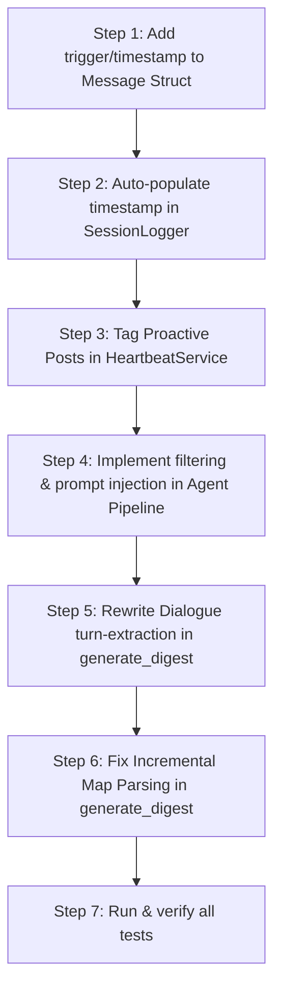

# Implementation Plan: Phase 22 — GeminiClaw Gap Recovery

This document outlines the concrete technical analysis, response policies, code-level design, and verification plan for implementing **Phase 22: GeminiClaw 移植ギャップの回収（Proactive Posts / heartbeat-digest 等）** in the RustyClaw codebase.

---

## 1. Executive Summary & Goals

The objective of Phase 22 is to recover functional parity with the original TypeScript upstream (**GeminiClaw**) in terms of:
1. **Proactive Posts (Self-Initiated Vocal Speak) Prompt Injections**: Re-injecting self-initiated messages from Discord/Telegram back into the system prompt of subsequent user turns so the agent remembers what it proactively said.
2. **Robust `heartbeat-digest.md` Generation**: Ensuring the heartbeat's incremental & deep activity scanning correctly aggregates dialogues, formats real timestamps, and handles tool-calling sessions without dropping assistant replies.
3. **Native LLM Tool Exposure**: Verifying that Tantivy-based `MemorySearchTool` and Obsidian REST-based `ObsidianWriteTool` are fully implemented, registered, and ready for LLM consumption.

---

## 2. Technical Gap Analysis & Concrete Response Policies

### 2.1. Proactive Posts Injection (No. 1)

#### The Gap:
In GeminiClaw, when the heartbeat proactively speaks to the user (e.g. notifying them of incoming rain), a session log entry is saved with `trigger: 'proactive'`. Upon the next user interaction, the prompt-builder scans the session JSONL, extracts any proactive posts sent *since the last user message*, excludes them from the raw conversational history, and formats them into a dedicated system prompt block:
```markdown
### Your Previous Posts in This Channel
You posted these messages (not in your conversation history):
- [YYYY-MM-DD HH:MM:SS]: (Truncated proactive post...)
```
In RustyClaw:
- The `Message` struct in `rustyclaw-providers` does not have `trigger` or `timestamp` fields.
- Proactive posts are appended to `sessions/<session_id>.jsonl` as normal assistant messages without these metadata tags.
- When loading history in `execute`/`execute_with_tools`, proactive posts are not filtered out, causing them to blend into raw history which disrupts formatting and LLM performance.

#### Response Policy:
1. **Extend `Message`**: Add optional `trigger` and `timestamp` fields to the `Message` struct in `crates/rustyclaw-providers/src/lib.rs`.
2. **Auto-Timestamp Logger**: Modify `SessionLogger::append_message` in `crates/rustyclaw-storage/src/lib.rs` to automatically fill the `timestamp` field with `chrono::Local::now().to_rfc3339()` if it is `None`.
3. **Tag Proactive Heartbeats**: Update `HeartbeatService::process_heartbeat_response` in `crates/rustyclaw-gateway/src/heartbeat.rs` to explicitly set `trigger: Some("proactive".to_string())` and `timestamp: Some(chrono::Local::now().to_rfc3339())` on the appended assistant message.
4. **Agent-Level Filter & Inject**: Update `crates/rustyclaw-agent/src/lib.rs` (`execute` and `execute_with_tools`):
   - Determine the timestamp of the last user message in the session history.
   - Filter out proactive messages (`trigger == Some("proactive")` and `timestamp > last_user_timestamp`).
   - Format the filtered proactive entries (last 5, truncated to 300 characters) into the `### Your Previous Posts in This Channel` markdown section and append it to `system_context`.
   - The remaining messages become the clean conversational history, preventing duplication.

---

### 2.2. `heartbeat-digest.md` 点検・修正 (No. 2)

#### The Gaps:
1. **Incremental Skip Bug**: In `generate_digest` in `heartbeat.rs`, if a session was not modified since `last_run_at`, it skips file reading even if `existing_digest_map` doesn't contain the session (e.g. if the digest file was empty, missing, or truncated). It must read the file if the key is missing from the map.
2. **Dialogue Extraction Bug (Tool-Calling Loops)**: The parser assumes a strict alternation of `user` followed immediately by `assistant`. In tool-using runs, however, the sequence is:
   `user` -> `assistant` (tool calls, empty content) -> `tool` -> `assistant` (final text content).
   The parser matches the empty tool-calling assistant message, skips the final assistant reply, and advances, producing empty digests.
3. **Hardcoded Timestamp**: The generated digest uses a dummy `[--:--]` prefix because the `Message` lacked a `timestamp`.
4. **Header Formatting**: It writes the digest without the `# Heartbeat Digest\n\n` header.

#### Response Policy:
1. **Robust Dialogue Parser**: Rewrite the turn extractor in `generate_digest` to find each `user` prompt, look ahead to locate the next user prompt (or end of file), and scan the intermediate range to extract the **last assistant message with non-empty content** as the turn's response.
2. **Dynamic Timestamps**: Parse each message's `timestamp` and format it as `[HH:MM]` in the local timezone, falling back to `[--:--]` if parsing fails.
3. **Map Parsing Safety**: Enhance map parsing with a flexible lookup that parses any timestamp format preceding the session name (`[XX:XX] ` or `[--:--] `).
4. **Correct Incremental Scan Logic**: Modify the loop so we only reuse `existing_digest_map` entries if `!is_deep_scan && !is_modified_since_last && existing_digest_map.contains_key(&session_id)` is fully satisfied. If the key is missing from the map, always read the file to ensure the digest is complete.
5. **Formatted Header**: Append `# Heartbeat Digest\n\n` to the start of the output file.

---

### 2.3. Tantivy & Obsidian Tools Exposure (No. 3)

#### Current Status Verification:
Upon inspection of the RustyClaw codebase, both tools are already fully implemented and registered:
- **Tantivy Search**: `MemorySearchTool` in `rustyclaw-tools` is registered under the name `memory_search` in `crates/rustyclaw-gateway/src/lib.rs` line 709.
- **Obsidian Write**: `ObsidianWriteTool` in `rustyclaw-tools` is registered under the name `obsidian_write_note` in `crates/rustyclaw-gateway/src/lib.rs` line 687 (enabled via `config.tools.obsidian.enabled`).

#### Action Plan:
- Confirm configuration structures are correct.
- Verify through unit tests that both tools register successfully.
- No further code modifications are required for No. 3 since both components are fully implemented and integrated.

---

## 3. Step-by-Step Implementation Sequence



### Step 1: Update `rustyclaw-providers` — `Message` Struct
File: [lib.rs](file:///home/kazuaki/Projects/RustyClaw/crates/rustyclaw-providers/src/lib.rs)

Add `trigger` and `timestamp` fields:
```rust
#[derive(Debug, Clone, Serialize, Deserialize, PartialEq, Eq, Default)]
pub struct Message {
    pub role: String,
    pub content: String,
    #[serde(skip_serializing_if = "Option::is_none")]
    pub name: Option<String>,
    #[serde(skip_serializing_if = "Option::is_none")]
    pub tool_calls: Option<Vec<ToolCall>>,
    #[serde(skip_serializing_if = "Option::is_none")]
    pub tool_call_id: Option<String>,
    #[serde(skip_serializing_if = "Option::is_none")]
    pub trigger: Option<String>,
    #[serde(skip_serializing_if = "Option::is_none")]
    pub timestamp: Option<String>,
}
```

### Step 2: Update `rustyclaw-storage` — `SessionLogger`
File: [lib.rs](file:///home/kazuaki/Projects/RustyClaw/crates/rustyclaw-storage/src/lib.rs)

Update `append_message` to auto-populate timestamp:
```rust
    pub fn append_message(&self, session_id: &str, message: &Message) -> Result<()> {
        std::fs::create_dir_all(&self.sessions_dir)
            .context("Failed to create sessions directory")?;

        let safe_session_id = session_id.replace(':', "-");
        let file_path = self.sessions_dir.join(format!("{}.jsonl", safe_session_id));
        
        let mut msg_to_log = message.clone();
        if msg_to_log.timestamp.is_none() {
            msg_to_log.timestamp = Some(chrono::Local::now().to_rfc3339());
        }

        let json_line = serde_json::to_string(&msg_to_log)
            .context("Failed to serialize message to JSON")?;
        ...
```

### Step 3: Update `rustyclaw-gateway` — `HeartbeatService`
File: [heartbeat.rs](file:///home/kazuaki/Projects/RustyClaw/crates/rustyclaw-gateway/src/heartbeat.rs)

Update `process_heartbeat_response` proactive post block to set `trigger` and `timestamp`:
```rust
            // 1. Proactive Post 注入 (ユーザーの会話履歴ファイルへ記録)
            let logger = SessionLogger::new(&self.workspace_path);
            let assistant_msg = Message {
                role: "assistant".to_string(),
                content: response_content.to_string(),
                name: None,
                trigger: Some("proactive".to_string()),
                timestamp: Some(chrono::Local::now().to_rfc3339()),
                ..Default::default()
            };
            let _ = logger.append_message(&target_session_id, &assistant_msg);
```

### Step 4: Update `rustyclaw-agent` — `Pipeline`
File: [lib.rs](file:///home/kazuaki/Projects/RustyClaw/crates/rustyclaw-agent/src/lib.rs)

In both `execute` and `execute_with_tools`:
Extract and filter out proactive posts, then inject them into `system_context`.
```rust
        let mut conversational_messages = Vec::new();
        let mut proactive_entries = Vec::new();

        if !session_id.starts_with("cron:") {
            let last_user_ts = history_messages.iter()
                .filter(|m| m.role == "user")
                .and_then(|m| m.timestamp.as_ref())
                .cloned();

            for msg in history_messages {
                if msg.trigger.as_deref() == Some("proactive") {
                    let is_after_last_user = match (&msg.timestamp, &last_user_ts) {
                        (Some(msg_ts), Some(user_ts)) => msg_ts > user_ts,
                        (Some(_), None) => true,
                        _ => false,
                    };
                    if is_after_last_user {
                        proactive_entries.push(msg);
                        continue;
                    }
                }
                conversational_messages.push(msg);
            }
        } else {
            conversational_messages = history_messages;
        }

        // Form Conversational History
        let mut history = ConversationHistory::new(conversational_messages);
        ...

        // If we have unreplied proactive posts, format and inject
        if !proactive_entries.is_empty() {
            let mut proactive_block = String::from("\n### Your Previous Posts in This Channel\nYou posted these messages (not in your conversation history):\n");
            let start_idx = proactive_entries.len().saturating_sub(5);
            for entry in &proactive_entries[start_idx..] {
                let ts = entry.timestamp.as_deref().unwrap_or("unknown");
                let formatted_ts = if let Ok(dt) = chrono::DateTime::parse_from_rfc3339(ts) {
                    dt.format("%Y-%m-%d %H:%M:%S").to_string()
                } else {
                    ts.to_string()
                };
                let content_preview = if entry.content.chars().count() > 300 {
                    let mut s: String = entry.content.chars().take(300).collect();
                    s.push_str("...");
                    s
                } else {
                    entry.content.clone()
                };
                proactive_block.push_str(&format!("- [{}]: {}\n", formatted_ts, content_preview));
            }
            system_context.push_str(&proactive_block);
        }
```

### Step 5: Update `rustyclaw-gateway` — `generate_digest`
File: [heartbeat.rs](file:///home/kazuaki/Projects/RustyClaw/crates/rustyclaw-gateway/src/heartbeat.rs)

1. Rewrite Map Parsing to accommodate dynamic timestamps:
```rust
                    if trimmed.starts_with('[') {
                        if let Some(close_bracket_idx) = trimmed.find("] ") {
                            let body = &trimmed[close_bracket_idx + 2..];
                            if let Some(colon_idx) = body.find(": ") {
                                let session_id = body[..colon_idx].to_string();
                                existing_digest_map.entry(session_id).or_default().push(trimmed.to_string());
                            }
                        }
                    }
```
2. Rewrite the dialogue extractor to locate the actual last reply of a tool-using or standard turn, format the timestamp, and write `# Heartbeat Digest\n\n`:
```rust
                    let mut i = 0;
                    let mut session_lines = Vec::new();
                    while i < messages.len() {
                        if messages[i].role == "user" {
                            let prompt = &messages[i].content;
                            let mut next_user_idx = messages.len();
                            for j in (i + 1)..messages.len() {
                                if messages[j].role == "user" {
                                    next_user_idx = j;
                                    break;
                                }
                            }
                            
                            let mut response = None;
                            for j in (i + 1)..next_user_idx {
                                if messages[j].role == "assistant" {
                                    if !messages[j].content.trim().is_empty() {
                                        response = Some(&messages[j].content);
                                    }
                                }
                            }

                            if let Some(resp_content) = response {
                                let clean_prompt = prompt.replace('\n', " ").chars().take(100).collect::<String>();
                                let clean_response = resp_content.replace('\n', " ").chars().take(100).collect::<String>();

                                let mut time_str = "--:--".to_string();
                                if let Some(ref ts) = messages[i].timestamp {
                                    if let Ok(dt) = chrono::DateTime::parse_from_rfc3339(ts) {
                                        let local_dt = dt.with_timezone(&Local);
                                        time_str = local_dt.format("%H:%M").to_string();
                                    }
                                }

                                session_lines.push(format!(
                                    "[{}] {}: {} → {}",
                                    time_str, session_id, clean_prompt, clean_response
                                ));
                            }
                            i = next_user_idx;
                        } else {
                            i += 1;
                        }
                    }
```

---

## 4. Verification & Testing Plan

1. **Pre-requisite Verification**: Check that `cargo test` passes prior to making changes (completed successfully).
2. **Incremental Modifications**: Apply changes sequentially and re-compile.
3. **Unit Tests Extension**:
   - Write `test_proactive_filtering_and_injection` in `rustyclaw-agent`'s tests to ensure proactive posts are parsed, filtered, and correctly formatted in the system prompt.
   - Update `test_generate_digest_persists_recent_dialogue` in `rustyclaw-gateway`'s heartbeat tests to write dummy messages with real timestamps, verifying the digest parses tool-calling logs correctly and extracts local timestamps.
4. **Integration Test Suite**: Run `cargo test` on all crates to guarantee zero regression.

---

## 5. Timeline & Execution

The implementation will be completed immediately during this session:
1. Perform file modifications for Step 1 & 2.
2. Perform file modifications for Step 3, 4, & 5.
3. Run tests and verify the complete suite passes without issue.
