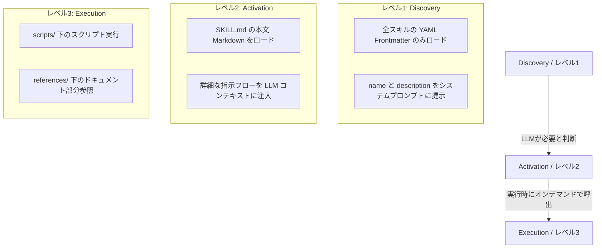

# Standard Agent Skills 統合ロードマップ・完全準拠実装計画

> [!NOTE]
> **日付**: 2026-05-31  
> **ステータス**: `[PLANNING & DETAILED DESIGN]`  
> **対象プロジェクト**: RustyClaw (Gateway & Agent & Tools)  
> **目的**: `https://agentskills.io/` の「標準Agent Skills仕様」とRustyClawの現状の実装レベルを比較し、差分を明確にした上で、標準SKILL仕様をネイティブに読み込み・対応できるようにするための移行・統合プランを提示する。

---

## 1. 標準Agent Skills仕様の要約 (agentskills.io)

「Standard Agent Skills」は、AIエージェントに新しい能力や専門知識をポータブルかつモジュール化された方法で提供するためのオープンスタンダードです。コンテキストウィンドウの制限やLLMのトークン消費量を最適化するために、**段階的開示（Progressive Disclosure）**アーキテクチャを採用しています。

### A. ディレクトリ構造
各スキルは単一のファイルではなく、自己完結型のディレクトリパッケージとして定義されます。

```
[skill-name]/
├── SKILL.md          # 必須: スキルのメタデータ (YAML) + エージェント指示 (Markdown)
├── scripts/          # オプション: 実行用スクリプト (bash, python 等)
├── references/       # オプション: 参照用静的ドキュメント (Markdown, JSON 等)
└── assets/           # オプション: 画像などの関連アセット
```

*   **命名規則**: ディレクトリ名およびスキル名は「1〜64文字の小文字英数字とハイフンのみ」とし、両者は一致させる必要があります。

### B. `SKILL.md` のフォーマット
`SKILL.md` は、必須 of **YAML Frontmatter** とそれに続く **Markdown本文（指示）** で構成されます。

#### 最小構成例:
```yaml
---
name: my-cool-tool
description: このスキルが何をするか、およびLLMがいつこのスキルを呼び出すべきかの明確なトリガー定義。
---
# Instructions
エージェントが実行時に従うべき詳細な指示やプロセスフロー。
```

#### オプション項目を含む例:
```yaml
---
name: pdf-processor
description: PDFドキュメントのパース、要約、データ抽出を行う。
license: MIT
compatibility: ">=1.0.0"
allowed-tools:
  - run_workspace_script
  - read_file
metadata:
  version: "1.2.0"
  author: "RustyClaw Dev Team"
---
# PDF Processor Instructions
1. PDFをパースするには、`scripts/parse-pdf.py` を実行してください。
2. 詳細なドキュメント構造については、[Reference Guide](references/STRUCTURE.md) を参照してください。
```

### C. 段階的開示 (Progressive Disclosure) アーキテクチャ
標準仕様の核心であり、トークン消費量を劇的に節約する仕組みです。



1.  **Discovery (レベル1 — 発見)**: 起動時に、エージェントは全スキルの **YAML Frontmatter (name と description)** のみをパースします。LLMには「どんなスキルがあるか、いつトリガーすべきか」の一覧だけを提示するため、コンテキスト消費を極小に抑えます。
2.  **Activation (レベル2 — 有効化)**: LLMが特定のスキルが現在のタスクに必要と判断した場合、`SKILL.md` の **本文（Markdown指示）** 全体をコンテキストに動的にロード・注入します。
3.  **Execution (レベル3 — 実行)**: タスクの解決中にさらに詳細が必要な場合や処理を行う場合、`scripts/` ディレクトリのスクリプトを実行したり、`references/` の詳細ドキュメントをオンデマンドで参照します。

---

## 2. RustyClawの現状の実装レベル

RustyClawは `Phase 29` において「Skills ファイルロードシステム」を独自に実装済みですが、これは **標準仕様を簡略化したもの** です。

### A. ディレクトリ・ファイル構造
*   **現状**: `production/workspace/skills/` ディレクトリ配下に、フラットな Markdown ファイル（例: `topic-patrol.md`, `vitals-coach.md`）が直接配置されています。
*   **サブディレクトリ**: `scripts/` や `references/` といったスキル個別のサブディレクトリは存在せず、スクリプトは `workspace/scripts/` ディレクトリに、ドキュメントは `docs/` にフラットに置かれています。

### B. 定義ファイルの形式
*   **現状**: 単なる Markdown ファイルです。YAML Frontmatter は含まれておらず、メタデータはありません。
*   **トリガー判定**: ファイル名（拡張子なし、例: `"topic-patrol"`) がトリガー名として機能します。

### C. ロードおよび注入エンジン (`crates/rustyclaw-gateway/src/skills.rs`)
*   **現状**: `inject_skill_content` 関数による **単純な文字列部分一致注入** です。
    - LLMに送信されるプロンプト全体の文字列（小文字化）に、スキル名（例: `"vitals-coach"`) が含まれているかを `lower.contains(skill_name)` でスキャンします。
    - 含まれていた場合、その `.md` ファイルの中身全体をプロンプトの先頭に `{}\n\n---\n\n{}` 形式で前置（注入）します。

---

## 3. 現状と標準仕様との差分 (Gap Analysis)

| 比較項目 | RustyClaw の現状 (Phase 29) | 標準 Agent Skills 仕様 (agentskills.io) | ギャップレベル |
| :--- | :--- | :--- | :--- |
| **配置ディレクトリ構造** | `skills/[skill-name].md` (フラット配置) | `skills/[skill-name]/SKILL.md` (ディレクトリ単位) | ⚠️ 中 (構造の移行が必要) |
| **メタデータの有無** | なし (ファイル名のみが識別子) | `SKILL.md` 先頭に YAML Frontmatter (`name`, `description`, `allowed-tools` 等) | 🔴 高 (パースエンジンの追加が必要) |
| **周辺リソースの局所化** | グローバル配置 (`workspace/scripts/` にフラット配置) | 各スキル配下の `[skill-name]/scripts/`, `references/` にカプセル化 | ⚠️ 中 (実行ツールのパス解決変更が必要) |
| **Discovery (レベル1)** | 未サポート (起動時にLLMに一覧を提示する仕組みはない) | 起動時に Frontmatter をパースし、一覧とトリガー条件を LLM に提示 | 🔴 高 (システムプロンプト構築ロジックが必要) |
| **Activation (レベル2)** | 簡易的 (プロンプトの文字列にスキル名が含まれたら一括前置) | LLMが Discovery を元に必要なスキルを判断し、動的に本文をロード | 🔴 高 (LLM主導または高度な動的注入必要) |
| **Execution (レベル3)** | グローバル実行 (`run_workspace_script`) | スキルローカルのスクリプト実行、ポータブルなモジュール完結 | ⚠️ 中 (セキュリティ境界の調整が必要) |

---

## 4. 詳細設計と Rust 実装計画（完全準拠の技術仕様）

標準 Agent Skills フォーマットへの完全準拠に向け、ゲートウェイとエージェントに実装する具体的な設計仕様を以下に定義します。

### A. Rust データ構造の定義 (`crates/rustyclaw-gateway/src/skills.rs`)
標準仕様に沿ってメタデータと本文を分離して保持するため、以下の型定義を導入します。

```rust
use serde::{Deserialize, Serialize};
use std::path::{Path, PathBuf};

/// `SKILL.md` の先頭にある YAML フロントマターを表すメタデータ構造体
#[derive(Debug, Serialize, Deserialize, Clone)]
pub struct SkillManifest {
    pub name: String,
    pub description: String,
    #[serde(rename = "allowed-tools")]
    pub allowed_tools: Option<Vec<String>>,
    pub license: Option<String>,
    pub compatibility: Option<String>,
    pub metadata: Option<serde_json::Value>,
}

/// メモリ上にキャッシュされるスキルオブジェクト
#[derive(Debug, Clone)]
pub struct Skill {
    pub manifest: SkillManifest,
    pub instructions: String,    // SKILL.md の本文部分 (Markdown)
    pub path: PathBuf,           // [skill-name]/ ディレクトリの絶対パス
}
```

### B. ハイブリッドローダー (YAML パーサー) の実装
既存のフラットな `.md` も疑似ラップしてパースしつつ、標準のディレクトリ構造も一括でスキャンできる耐久性の高いローダーを構築します。
YAMLフロントマターの切り出しには、マークダウン解析で定評のある `gray_matter` クレートを採用します。

```rust
// Cargo.toml に gray_matter = "0.2" を追加

use gray_matter::{Matter, YAML};

pub fn load_skills(workspace_path: &Path) -> Vec<Skill> {
    let skills_dir = workspace_path.join("skills");
    let mut skills = Vec::new();

    if !skills_dir.exists() {
        return skills;
    }

    let Ok(entries) = std::fs::read_dir(&skills_dir) else {
        return skills;
    };

    let matter = Matter::<YAML>::new();

    for entry in entries.flatten() {
        let path = entry.path();
        
        // パターン1: ディレクトリ構造 [skill-name]/SKILL.md
        if path.is_dir() {
            let skill_md_path = path.join("SKILL.md");
            if skill_md_path.exists() {
                if let Ok(content) = std::fs::read_to_string(&skill_md_path) {
                    if let Some(skill) = parse_standard_skill(&content, &path, &matter) {
                        skills.push(skill);
                        continue;
                    }
                }
            }
        }
        
        // パターン2: 従来互換フラットファイル [skill-name].md (フォールバック)
        if path.is_file() && path.extension().and_then(|e| e.to_str()) == Some("md") {
            if let Ok(content) = std::fs::read_to_string(&path) {
                let skill_name = path.file_stem().unwrap_or_default().to_string_lossy().to_string();
                let skill = parse_fallback_skill(&content, &skill_name, &path.parent().unwrap().to_path_buf(), &matter);
                skills.push(skill);
            }
        }
    }
    skills
}

/// 標準 SKILL.md ファイルのパース
fn parse_standard_skill(content: &str, dir_path: &Path, matter: &Matter<YAML>) -> Option<Skill> {
    let result = matter.parse(content);
    let manifest: SkillManifest = result.data?.deserialize().ok()?;
    
    Some(Skill {
        manifest,
        instructions: result.content,
        path: dir_path.to_path_buf(),
    })
}

/// 従来のフラットマークダウンを疑似 manifest にラップして下位互換
fn parse_fallback_skill(content: &str, file_name: &str, base_path: &Path, matter: &Matter<YAML>) -> Skill {
    // 既にYAMLが含まれているかチェック
    if let Some(skill) = parse_standard_skill(content, base_path, matter) {
        return skill;
    }

    // YAMLが含まれていないプレーンなマークダウンの場合
    let lines: Vec<&str> = content.lines().collect();
    let description = lines.iter()
        .find(|l| !l.is_empty() && !l.starts_with("#"))
        .copied()
        .unwrap_or("RustyClaw Fallback Skill")
        .to_string();

    Skill {
        manifest: SkillManifest {
            name: file_name.to_lowercase(),
            description,
            allowed_tools: None,
            license: None,
            compatibility: None,
            metadata: None,
        },
        instructions: content.to_string(),
        path: base_path.join(file_name),
    }
}
```

### C. Discovery (レベル1) のシステムプロンプト自動生成
システムプロンプトの構築段階において、ロードされた全スキルの Discovery 情報を LLM に提示します。

```rust
/// LLMのシステムプロンプトにインジェクトするための Skills Directory (発見情報) を生成
pub fn generate_skills_directory(skills: &[Skill]) -> String {
    if skills.is_empty() {
        return String::new();
    }

    let mut dir_str = String::from("\n\n## 🛠️ Available Agent Skills (Discovery)\n");
    dir_str.push_str("You have access to the following specialized capabilities. To activate detailed instructions for a skill, include the skill's identifier (e.g. `[use-skill: vitals-coach]`) in your internal chain of thought.\n\n");

    for skill in skills {
        dir_str.push_str(&format!(
            "- **`{}`**: {}\n",
            skill.manifest.name,
            skill.manifest.description
        ));
    }
    dir_str
}
```

### D. Activation (レベル2) の動的インジェクションの実装
プロンプトの送信直前に会話履歴やシステムプロンプトを横断してスキャンし、アクティベートされたスキルの本文（Markdown）を動的マージするエンジンを `skills.rs` に構築します。

```rust
/// コンテキストの内容に応じて、必要な SKILL.md 本文を動的にマージする
pub fn inject_active_skills(workspace_path: &Path, raw_system_prompt: &str, user_request: &str) -> String {
    let skills = load_skills(workspace_path);
    if skills.is_empty() {
        return raw_system_prompt.to_string();
    }

    let search_target = format!("{} {}", raw_system_prompt.to_lowercase(), user_request.to_lowercase());
    let mut injected_instructions = String::new();

    for skill in skills {
        // LLMがシステムプロンプト指示に基づき、トリガーワード [use-skill: name] を含めたか、
        // またはユーザー要求内に明示的にスキル識別子が含まれているかをスキャン
        let trigger_tag = format!("use-skill: {}", skill.manifest.name);
        let name_match = format!("skill:{}", skill.manifest.name);
        
        if search_target.contains(&trigger_tag) 
            || search_target.contains(&name_match) 
            || search_target.contains(&skill.manifest.name) 
        {
            tracing::info!("Activation: Dynamic loading of skill '{}'", skill.manifest.name);
            injected_instructions.push_str(&format!(
                "\n\n--- [ACTIVE SKILL: {}] ---\n{}\n",
                skill.manifest.name,
                skill.instructions.trim()
            ));
        }
    }

    if injected_instructions.is_empty() {
        raw_system_prompt.to_string()
    } else {
        format!("{}{}", raw_system_prompt, injected_instructions)
    }
}
```

### E. Execution (レベル3) のスクリプト実行パスとバリデーション
`run_workspace_script` ツールの引数 `script_name` を処理する際、スキル固有のディレクトリからのパス解決をサポートすると同時に、安全なサンドボックス境界を維持するためのセキュリティチェックを追加します。

```rust
/// crates/rustyclaw-tools/src/lib.rs におけるパス解決のセキュアな拡張設計
pub fn resolve_secure_script_path(workspace_path: &Path, script_name: &str) -> Result<PathBuf, String> {
    // 1. ディレクトリトラバーサルの厳格な防御
    if script_name.contains("..") || script_name.starts_with('/') || script_name.contains("\\") {
        return Err("Security Violation: Path traversal is strictly prohibited.".to_string());
    }

    // 2. パス形式の解析
    // パターンA: skills/[skill-name]/scripts/[script-name] (局所化されたスクリプト)
    if script_name.starts_with("skills/") {
        let full_path = workspace_path.join(script_name);
        if full_path.exists() && full_path.is_file() {
            return Ok(full_path);
        }
    }

    // パターンB: 従来互換のグローバル scripts/[script-name] (フォールバック)
    let global_path = workspace_path.join("scripts").join(script_name);
    if global_path.exists() && global_path.is_file() {
        return Ok(global_path);
    }

    Err(format!("Script not found in workspace paths: '{}'", script_name))
}
```

---

## 5. 既存8スキルの完全移行プラン（マイグレーション手順）

現在 `production/workspace/skills/` にある8つのフラットなマークダウンファイルを、以下のパッケージ構造に段階的にマイグレーションします。

### マイグレーション対応表

| スキル名 | 現状のファイル | 移行後のディレクトリと構成 | 同封・局所化するスクリプト (Phase C) |
| :--- | :--- | :--- | :--- |
| **vitals-coach** | `vitals-coach.md` | `skills/vitals-coach/`<br>├── `SKILL.md`<br>└── `scripts/500_get-vital-data-garmin.sh` | `500_get-vital-data-garmin.sh` |
| **daily-briefing** | `daily-briefing.md` | `skills/daily-briefing/`<br>├── `SKILL.md`<br>└── `scripts/` (必要な場合) | なし |
| **deep-research** | `deep-research.md` | `skills/deep-research/`<br>├── `SKILL.md`<br>└── `scripts/` (必要な場合) | なし |
| **session-logs** | `session-logs.md` | `skills/session-logs/`<br>├── `SKILL.md`<br>└── `scripts/`<br>&nbsp;&nbsp;&nbsp;&nbsp;├── `session-stats.sh`<br>&nbsp;&nbsp;&nbsp;&nbsp;└── `session-search.sh` | `session-stats.sh`<br>`session-search.sh` |
| **todo-tracker** | `todo-tracker.md` | `skills/todo-tracker/`<br>├── `SKILL.md` | なし |
| **topic-patrol** | `topic-patrol.md` | `skills/topic-patrol/`<br>├── `SKILL.md`<br>└── `scripts/` (巡回用) | `501_karakeep-tag-items.sh` 等 |
| **workspace** | `workspace.md` | `skills/workspace/`<br>├── `SKILL.md` | なし |
| **coding-plan** | `coding-plan.md` | `skills/coding-plan/`<br>├── `SKILL.md` | なし |

### マイグレーション手順例 (`vitals-coach` の場合)
1. フォルダ `skills/vitals-coach/` を作成。
2. `vitals-coach.md` を `skills/vitals-coach/SKILL.md` としてコピー。
3. `SKILL.md` の先頭に以下の YAML Frontmatter を追加。
   ```yaml
   ---
   name: vitals-coach
   description: Garmin Connectからバイタルデータ（歩数、心拍、ストレス、BB、睡眠）を取得し、体調分析とアドバイスを提供するスキル。
   allowed-tools:
     - run_workspace_script
   ---
   # Vitals Coach Skill
   (元のマークダウン本文)
   ```
4. `workspace/scripts/500_get-vital-data-garmin.sh` を `skills/vitals-coach/scripts/` 配下に移動する（※Phase C実行時）。
5. `SKILL.md` 内のスクリプト呼び出しパス定義を更新する。

---

## 6. テスト・実機検証計画

完全準拠を保証するため、自動テストと RPi4 での実機テストを実行します。

### A. 自動テストの記述
`crates/rustyclaw-gateway/src/skills.rs` にモックファイルシステムを用いた以下のテストを追加します。

1.  **YAML Manifest パーステスト**: 
    YAML が正しくパースされ、`SkillManifest` 構造体にマップされることを確認する。
2.  **ハイブリッドローダー互換性テスト**: 
    `[skill]/SKILL.md` と `[skill].md` が同一ディレクトリに混在している際、どちらも正常に `load_skills` されるか検証する。
3.  **Discovery 提示テスト**: 
    `generate_skills_directory` から出力された文字列が LLM のシステムプロンプトに適切に差し込まれているか検証する。
4.  **Activation 動的ロードテスト**: 
    プロンプトの内容からスキル名が検知された際、指定の `Skill` 本文が自動でマージされることを検証する。

### B. 実機デプロイ検証（RP1）
1.  自動テストの全パス確認後、`./scripts/deploy.sh` により Raspberry Pi 4 (`rp1`) へデプロイ。
2.  Discord チャンネル上で、旧形式のままのスキルと、移行した新形式のスキルが同様に動作（自動トリガーされること）を監視。
3.  デバッグログにて `Activation: Dynamic loading of skill 'vitals-coach'` のログが発火しているか、設定初期化遅延が発生していないかを監視します。
