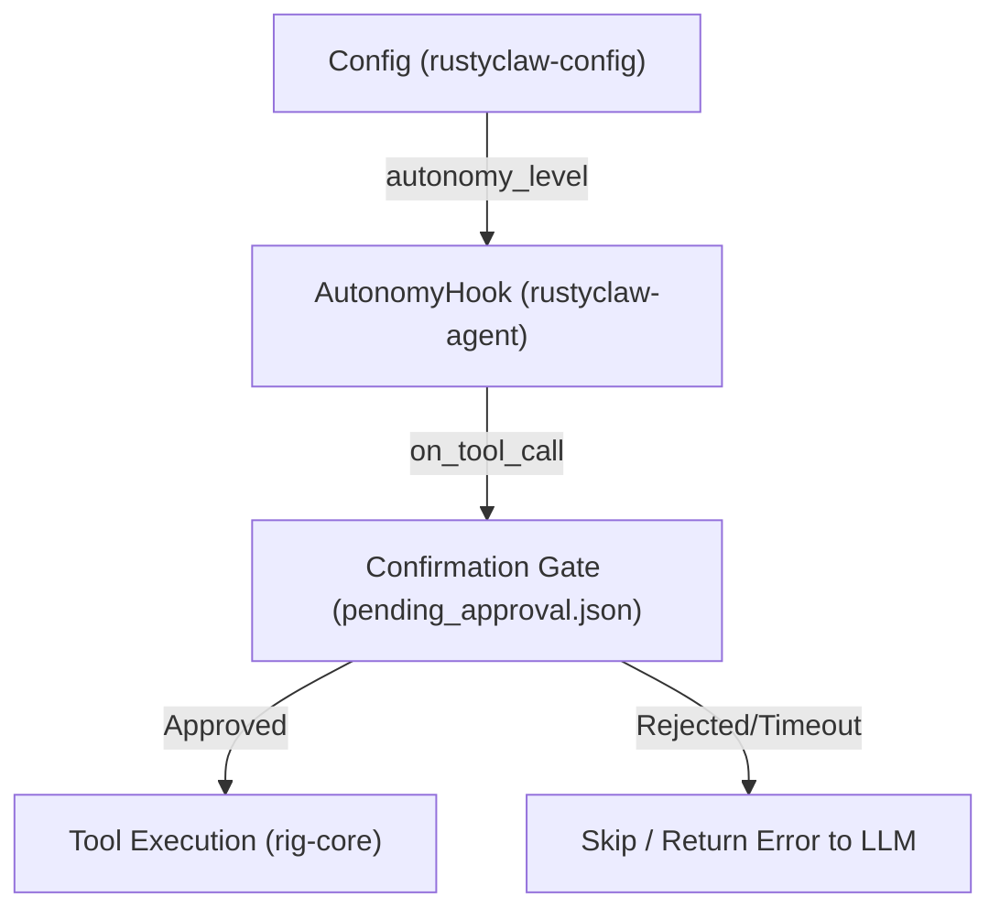

# Autonomy Level & Confirmation Gate Implementation Plan

ラズパイ等の実機運用環境における安全性・表現力・利便性の最大化のため、エージェントの自律性制御システム（Autonomy Level）と、書き込み/破壊的操作に対するユーザー承認ゲート（Confirmation Gate）を導入します。

---

## 1. 概要と要件

### Autonomy Level (自律レベル)
`Config` に `autonomy_level` 設定を追加し、以下の3段階で動作を制御します。
- **`autonomous` (デフォルト)**: 承認なしですべてのツールを実行可能（従来通り）。
- **`supervised` (監視モード)**: 参照系ツールはそのまま実行し、書き込み・変更系ツールは実行前に一時停止してユーザーの承認ファイル (`pending_approval.json`) 更新を待機する。
- **`read_only` (読み込み専用)**: 書き込み・変更系ツールの実行要求を即座にエラー（Permission Denied）として却下する。

### Confirmation Gate (承認ゲート)
`supervised` モードでの書き込みアクション時：
1. 実行を非同期でブロッキングし、`{workspace}/pending_approval.json` を作成する。
2. JSONファイルには、ツール名、引数、承認状況 (`"status": "pending"`) を書き込む。
3. チャットやログに警告メッセージを出力：`⚠️ [CONFIRMATION REQUIRED] ...`
4. 1秒ごとにファイルの `status` フィールドをポーリング監視する（最大300秒）。
   - `"status": "approved"` に変更されたら実行を許可し、ファイルを削除して続行。
   - `"status": "rejected"` に変更されるか、タイムアウト（5分）した場合は、エラーを返し実行を却下する。

---

## 2. 具体的な実装設計



### ① `crates/rustyclaw-config/src/lib.rs` (Config の拡張)
- `AutonomyLevel` enum を定義：
  ```rust
  #[derive(Debug, Clone, Copy, PartialEq, Eq, Serialize, Deserialize)]
  #[serde(rename_all = "snake_case")]
  pub enum AutonomyLevel {
      Autonomous,
      Supervised,
      ReadOnly,
  }

  impl Default for AutonomyLevel {
      fn default() -> Self {
          Self::Autonomous
      }
  }
  ```
- `Config` 構造体に `autonomy_level: AutonomyLevel` フィールドを `#[serde(default)]` で追加。

### ② `crates/rustyclaw-agent/src/lib.rs` (インターセプターの実装)
`rig-core` の `PromptHook` には、ツールが実行される直前に割り込める `on_tool_call` が定義されているため、これを利用して一元的にインターセプトを行います。

#### 1. 書き込みツールの判定ロジックの実装
```rust
fn is_write_operation(tool_name: &str) -> bool {
    if tool_name == "workspace_write" || tool_name == "workspace_execute_script" || tool_name == "cron_schedule" {
        return true;
    }
    
    let lower = tool_name.to_lowercase();
    lower.contains("write")
        || lower.contains("delete")
        || lower.contains("create")
        || lower.contains("update")
        || lower.contains("post")
        || lower.contains("patch")
        || lower.contains("send")
        || lower.contains("execute")
}
```

#### 2. `run_confirmation_gate` の実装
ポーリングを用いて `pending_approval.json` の変更を非同期に監視します。
```rust
async fn run_confirmation_gate(tool_name: &str, args: &str, workspace_dir: &std::path::Path) -> Result<bool> {
    let approval_file = workspace_dir.join("pending_approval.json");
    let req_id = format!("req-{}", chrono::Local::now().format("%Y%m%d%H%M%S"));
    
    let parsed_args: serde_json::Value = serde_json::from_str(args).unwrap_or(serde_json::Value::String(args.to_string()));
    
    let req_data = serde_json::json!({
        "id": req_id,
        "tool_name": tool_name,
        "arguments": parsed_args,
        "status": "pending",
        "created_at": chrono::Local::now().to_rfc3339()
    });
    
    let file_content = serde_json::to_string_pretty(&req_data)?;
    std::fs::write(&approval_file, file_content)?;
    
    tracing::warn!(
        "⚠️ [CONFIRMATION REQUIRED] Tool '{}' wants to execute.\nArguments: {}\nTo approve, modify 'status' to 'approved' in {}.",
        tool_name,
        args,
        approval_file.display()
    );
    
    let start_time = std::time::Instant::now();
    let timeout = std::time::Duration::from_secs(300);
    let mut approved = false;
    
    while start_time.elapsed() < timeout {
        tokio::time::sleep(std::time::Duration::from_secs(1)).await;
        
        if !approval_file.exists() {
            break;
        }
        
        if let Ok(content) = std::fs::read_to_string(&approval_file) {
            if let Ok(val) = serde_json::from_str::<serde_json::Value>(&content) {
                if let Some(status) = val.get("status").and_then(|s| s.as_str()) {
                    if status == "approved" {
                        approved = true;
                        break;
                    } else if status == "rejected" {
                        break;
                    }
                }
            }
        }
    }
    
    if approval_file.exists() {
        let _ = std::fs::remove_file(&approval_file);
    }
    
    Ok(approved)
}
```

#### 3. フック構造体の拡張
既存の `HeartbeatHook` を拡張するか、共通 of `AgentHook` を用意し、`PromptRequest::with_hook` を用いてフックします。

---

## 3. テスト計画

### ユニットテストの作成
- `test_autonomy_level_read_only_blocks_write`: `ReadOnly` モード時に書き込みツールを実行すると即座に却下されることを検証。
- `test_autonomy_level_supervised_approves`: `Supervised` モードでファイルに `"status": "approved"` が書き込まれた際に、ツール呼び出しが続行されることを検証。
- `test_autonomy_level_supervised_rejects`: `Supervised` モードでタイムアウトまたは拒否された場合に却下となることを検証。
