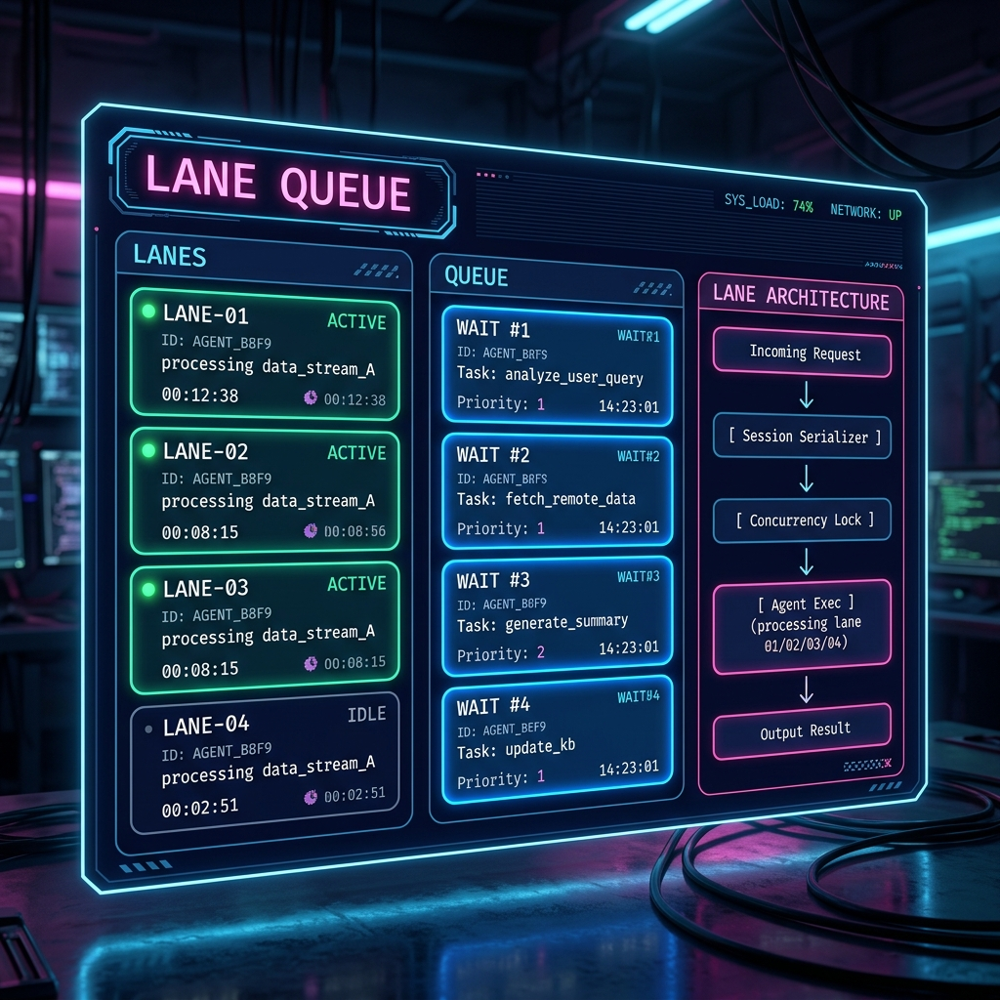

# LANE QUEUE 可視化・仕様ダイアグラム実装レポート

ダッシュボードにおける `LANE QUEUE` パネルの視覚的改善と、処理フロー（4層アーキテクチャ）の図解モデル追加の実装内容をまとめました。

---

## 1. 視覚的モックアップ

以下は、今回実装したレイアウトを視覚的に表現したUIモックアップです。

---

## 2. 実装のポイント

### ① 3カラムグリッドレイアウトの導入
パネル内部のレイアウトを `grid-template-columns: 136px 1fr 148px;` に変更し、右端に図解を配置するための専用スペースを確保しました。

### ② アーキテクチャ図解のインプロセスレンダリング
`LANE ARCHITECTURE` として、リクエストが処理される流れをテキストベースで分かりやすく図解化しました。
1. **Incoming Request** (リクエスト受付)
2. **Session Serializer** (セッションごとの直列FIFOキュー)
3. **Concurrency Lock** (`gmn_sem`: 同時実行数制限 最大4)
4. **Agent Exec (gmn)** (エージェント本体の実行)

### ③ 待機中タスク（FIFO）の順序可視化
待機中のタスクがどの順番で待っているかを明確にするため、以下の変更を行いました。
* `enqueued_at_ms` (キュー追加時刻) を基準にして、昇順に確実にソートして表示。
* 待機ステータスラベルを単純な `WAIT` から `WAIT #1`, `WAIT #2`... のように動的インデックス表示に変更。

---

## 3. 対象ソースファイル

*   [crates/rustyclaw-gateway/src/health.rs](file:///home/kazuaki/Projects/RustyClaw/crates/rustyclaw-gateway/src/health.rs#L824-L855) (CSS定義)
*   [crates/rustyclaw-gateway/src/health.rs](file:///home/kazuaki/Projects/RustyClaw/crates/rustyclaw-gateway/src/health.rs#L1075-L1130) (JavaScript / 表示ロジック更新)
