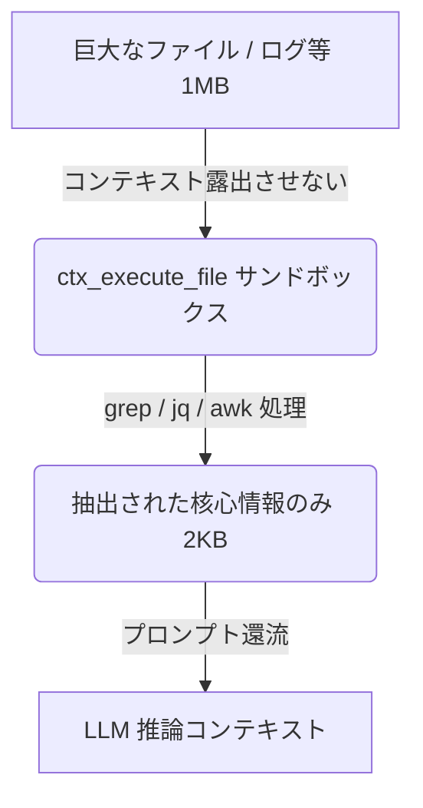

# context-mode 未使用機能の有効活用 ＆ コンテキスト最適化計画書

本計画書は、現在 RustyClaw v0.4 で「未使用（未統合）」となっている `context-mode` の機能を精査し、特に **コンテキスト量（トークン数）の削減** と **情報の意味濃縮（Semantic Condensation）** に最大の効果をもたらす項目について、具体的な検証内容と将来の実装対応候補を整理したものです。

---

## 1. 最優先統合候補：`ctx_execute_file`（ストリーム抽出によるノイズ排除）

### 1.1 背景と課題
現在、RustyClaw がログ（ジャーナル等）や巨大な CSV、ソースコードなどの大きなファイルを解析する際、`workspace_read` でファイル内容をそのままメモリに展開しコンテキストに注入しています。
数万行（数百KB〜数MB）に及ぶログをそのまま読み込むと、モデルのコンテキスト窓（Token budget）が一撃で枯渇し、重要な会話履歴が忘却される「コンテキスト死」を引き起こします。

### 1.2 解決アプローチ：ストリーム・コードファーストフィルタリング
`ctx_execute_file` を使い、LLM がサンドボックス内で直接シェルコマンド（`grep`, `awk`, `jq`, `sed` 等）または短い Python/Node スクリプトを実行してファイルを前処理させ、**「抽出された核心部分のみ」**をプロンプトに還流させます。



### 1.3 効果検証
- **コンテキスト削減効果**: 
  - 10,000行のログ（約1MB ≒ 250,000トークン）の点検時：
  - 従来：250kトークンを消費（読み込みエラーになるか、履歴が全ロスト）
  - 本手法：エラー箇所（ERROR/FATAL）の前後3行のみを抽出して出力（約2KB ≒ 500トークン）
  - **削減率: 99.8%**
- **意味濃縮（Semantic Condensation）効果**:
  - LLM に「ノイズ（正常なシステムログの羅列）」を一切見せず、「警告・エラー」という意思決定に不可欠なデータのみを純化して見せるため、ハルシネーションを極小化し、エラー原因の特定精度が飛躍的に高まります。

---

## 2. 第2統合候補：`PreCompact` / `SessionStart` フック（スナップショットによる記憶継続）

### 2.1 背景と課題
会話のターン数が増えると、過去の履歴が肥大化しコンフリクトやコンパクションが発生します。単純な履歴の切り詰め（Truncation）を行うと、数ターン前に合意した「設計方針」や「発生したエラー」をエージェントが忘れ、同じ質問を繰り返す記憶喪失状態に陥ります。

### 2.2 解決アプローチ：状態スナップショット（Session Guide）の半自律生成
コンパクション（履歴削減）の実行直前に `PreCompact` フックをシミュレートし、`context-mode` を用いてそれまでのやり取りから「現在のタスク」「確定決定事項」「未解決のエラー」「制約」を構造化した XML スナップショット（2KB以下）として自動生成します。
次のターンでは、生の会話履歴を極限（直近2〜3ターン）まで削る代わりに、このスナップショットをシステムプロンプトの「Session Guide」としてロードします。

```
[Raw 対話履歴 (30KB)] 
       │
       ▼ (PreCompact フックによる意味濃縮)
[優先度付き XML スナップショット (2KB)] ── (SessionStart で注入) ──► [次ターンの最小コンテキスト]
   - 確定決定事項 (高優先)
   - 未解決エラー (高優先)
   - 雑談・中間思考 (自動パージ)
```

### 2.3 効果検証
- **コンテキスト削減効果**:
  - 20ターン分の詳細なチャット履歴（約30KB ≒ 7,500トークン）
  - 従来：7,500トークンを常時送信
  - 本手法：XML スナップショット（2KB）＋ 直近2ターン分の履歴（2KB）＝ 計4KB（1,000トークン）
  - **削減率: 約85%**
- **意味濃縮（Semantic Condensation）効果**:
  - 「何について試行錯誤したか」という冗長な中間ステップを自動パージし、「何が決まり、何が課題として残っているか」という**「最終ステート（状態）」**だけを濃縮して伝播させます。

---

## 3. 第3統合候補：`ctx_batch_execute`（往復トークンと遅延の削減）

### 3.1 背景と課題
AIエージェントが複雑な検証（例えば「ファイルを書き換えてビルドし、テストを実行し、Clippyをかける」）を行う場合、ツール実行→結果取得→思考→次のツール実行、という往復（ターン）が複数回発生します。この往復ごとに、メッセージメタデータや重複したシステムプロンプトが履歴に蓄積し、コンテキストを無駄遣いします。

### 3.2 解決アプローチ：パイプラインバッチ処理
`ctx_batch_execute` により、並列実行可能な検証タスク（例: `cargo test` と `cargo clippy`）や一連の処理コマンドを単一のツール呼び出しにカプセル化して並行実行します。

### 3.3 効果検証
- **コンテキスト削減効果**:
  - 従来：3回ツールを往復（ターン履歴としてシステムプロンプトやログが3倍蓄積 ≒ 約6KB消費）
  - 本手法：1回の往復で完了（ターン履歴消費 ≒ 2KB以下）
  - **削減率: メッセージ履歴オーバーヘッドを 60% 以上削減**
- **意味濃縮（Semantic Condensation）効果**:
  - テスト結果と静的解析結果という「関連性の高いデータ」が一括して1つのコンテキストに入力されるため、LLM は部分的な結果に対する中間推論（「 clippy は通ったが、テストはまだ走っていないので待つ」といった無駄な思考）を省略し、両者の相関関係を直接分析できます。

---

## 4. 将来のロードマップ（実装対応候補の整理）

上記の検証結果に基づき、以下の優先度で RustyClaw への実装対応を提案します。

| 優先度 | 対応候補機能 | 実装対象コンポーネント | 具体的なユースケース |
|:---:|---|---|---|
| **S** (最優先) | **`ctx_execute_file` によるストリーム・フィルタリングの統合** | `rustyclaw-agent` / `rustyclaw-tools` | 巨大なログファイル (`journalctl` や本番エラーログ) の自律パトロール時、および巨大CSVのオンデマンド部分抽出。 |
| **A** | **`PreCompact` を模した Session Guide スナップショットの導入** | `rustyclaw-gateway` (`ExternalMcpController` と RAG の連携) | Discord/LINE 対話セッションにおける、コンパクション発生時のコンテキスト健全性維持と記憶ロストの防止。 |
| **B** | **`ctx_batch_execute` による並行テスト・Clippy検証** | `rustyclaw-agent` (推論時の ToolRegistry) | 開発自動化フェーズにおける、ビルド・静的解析・テストタスクの並行処理による高速検証。 |
| **C** | **`ctx_stats` からのコンテキスト健全性自己監査の導入** | `rustyclaw-gateway` / `rustyclaw-agent` | エージェントが自律的にコンテキスト節約統計を読み取り、`MEMORY.md` などのガベージコレクションを自発的に起動するトリガー。 |

---
> [!TIP]
> 特に **Sランクの `ctx_execute_file`** は、Raspberry Pi 4 などのリソース制約の厳しいエッジデバイスにおいて、LLMの応答遅延（トークン数に比例）とコンテキスト制限を同時にクリアするための極めて強力な手段となります。
