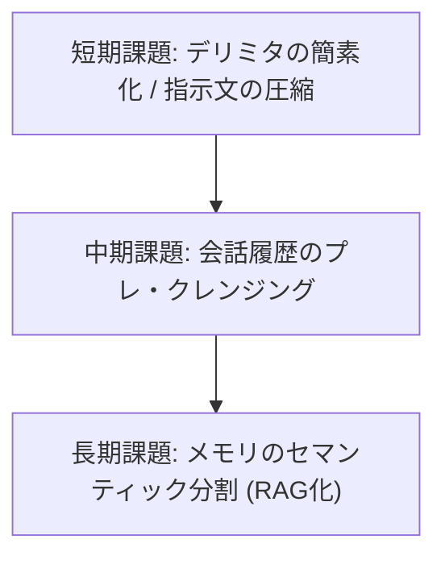

# RustyClaw Memory Flush コンテキスト窓 最適化提案書

## 1. 概要と目的
本ドキュメントは、RustyClaw の会話完了後に実行される「長期記憶更新プロセス（以下、`memory flush`）」において、コンテキスト窓（Context Window）およびトークン消費を最適化するための具体的な改善案を提示するレポートです。
ローカルモデル（`google/gemma-4-12b-qat`等、コンテキスト上限 32k）の特性を最大限に活かし、レスポンスの高速化とトークン溢れによるエラーを未然に防ぐことを目的とします。

---

## 2. 現在の課題
現状の `memory flush` における LLM リクエストには、以下の要因によるコンテキスト窓の圧迫と冗長なトークン消費が見られます。

1.  **冗長な区切りデリミタ**: `---NEW_MEMORY---` や `---END_DAILY_LOG---` などの長大な区切り記号が、毎回の往復で合計約 25 トークンを無駄に消費している。
2.  **システム指示文（プロンプト）の冗長性**: 英語のシステム指示文が非常に丁寧に書かれているものの、要約・マージといった処理に対しては指示が長く、約 150 トークン以上を消費している。
3.  **会話履歴（Recent Conversation）の無加工注入**: ユーザーの「おはよう」等の短い会話では問題ないが、実運用に伴い会話が長くなった場合、システムメッセージや一時的な警告、ノイズテキストを含んだまま LLM に渡され、入力トークンが指数関数的に増大する。

---

## 3. 改善ロードマップ



---

## 4. 具体的な改善策

### 4.1. 【短期改善】デリミタのXMLタグ化と指示文の極限スリム化
毎回の呼び出しで固定で消費される「固定トークン（オーバーヘッド）」を削減します。

#### A. デリミタの XML スタイル移行
長大なテキストデリミタを、LLM が構造解釈しやすい XML 形式に変更します。

*   **変更前**:
    *   `---NEW_MEMORY---` / `---END_MEMORY---`（12トークン）
    *   `---DAILY_LOG---` / `---END_DAILY_LOG---`（13トークン）
*   **変更後**:
    *   `<mem>` / `</mem>`（4トークン）
    *   `<log>` / `</log>`（4トークン）
*   **期待効果**: 毎回の往復で **約17トークン** の節約。

#### B. システムプロンプトの高密度化（スリム化）
モデル追従性を落とさずに、指示文を高密度に圧縮します。ローカルモデルの日本語能力が高いため、記述ニュアンスを保ちやすい日本語版のスリム指示を推奨します。

*   **スリム化プロンプト案（日本語）**:
    ```markdown
    会話を基に、長期記憶（MEMORY.md）の更新と要約ログを作成してください。

    出力形式（余計な説明は省き、タグとその中身のみ出力すること）:
    <mem>
    [更新後の MEMORY.md 全文（新しい事実や好みを反映し重複を整理。変更がない場合は元の内容をそのまま出力）]
    </mem>
    <log>
    * [会話の要約（箇条書きで簡潔に）]
    </log>
    ```
*   **期待効果**: 指示文部分だけで **約80〜100トークン** の削減。

---

### 4.2. 【中期改善】会話履歴（Recent Conversation）のプレ・クレンジング
LLM に渡す前の「会話履歴」から不要なテキストをプログラム側でフィルタリングして削ります。

1.  **ノイズテキストの除去**:
    *   システム側で出力された一時的なエラーメッセージ、警告文、進捗ゲージなどを、LLM に引き渡す前に正規表現等で除外。
2.  **スライディング・ウィンドウ & 部分要約**:
    *   直近の会話履歴が一定量（例: 4,000トークン）を超えた場合、履歴そのものを渡すのではなく、システムが自動生成した「中間のセッション要約」に置換して引き渡す。これにより、会話がどれだけ長引いても一定のコンテキスト消費量（数千トークン以内）で推移します。

---

### 4.3. 【長期改善】MEMORY.md のセマンティック分割（RAG 化）
長期記憶（`MEMORY.md`）自体が数十KB〜数百KB規模に肥大化した場合、全文を毎回 LLM に送ることは現実的ではなくなります。

1.  **セクションごとの分割管理**:
    *   `MEMORY.md` を「ユーザー基本情報」「仕事の文脈」「趣味・好み」といったセクションごとに分割してデータベース化。
2.  **動的なコンテキスト注入 (RAG)**:
    *   直近の会話内容から関連するキーワードやベクトルを抽出し、**関連のあるセクションのみを抽出してシステムプロンプトに動的に注入**する。
    *   変更のあったセクションのみを LLM にマージ・書き換えさせ、システム側で該当セクションのみをアップデートして再結合する。
*   **期待効果**: 長期記憶の量がどれだけ増えても、LLM に送信するコンテキスト量を常に最小限に抑えることが可能になります。

---

## 5. 導入によるインパクト予測

| 項目 | 改善前 (想定) | 改善後 (短期適用) | 削減率 |
| :--- | :--- | :--- | :--- |
| デリミタ消費量 | 25 tokens | 8 tokens | **68% 削減** |
| システム指示文消費量 | 165 tokens | 75 tokens | **54% 削減** |
| 最小往復オーバーヘッド | 190 tokens | 83 tokens | **56% 削減** |
| 長期稼働時の対話耐性 | 会話が長引くと溢れる | プレ・クレンジングにより安定 | **極めて高い** |
