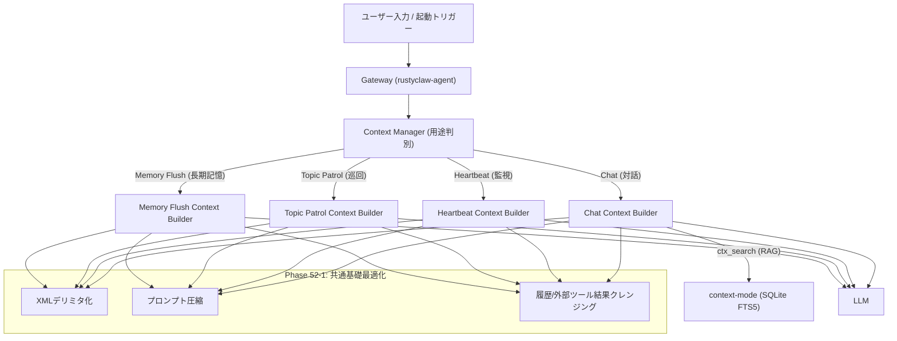

# RustyClaw 用途別 LLM コンテキスト最適化・軽量化設計仕様書

> [!NOTE]
> **ステータス**: `[ACTIVE]`  
> **最終更新日**: 2026-06-13  
> **対象スコープ**: Phase 52 全般の再設計と実装ロードマップ  

## 1. 目的と全体方針

RustyClaw の運用にあたり、LLM リクエストで送信されるコンテキスト（システムプロンプト、ツール定義、対話履歴等）の最適化と軽量化を図り、トークン消費の削減、レスポンスの高速化（TTFT の短縮）、およびコンテキスト窓（32k）の効率的管理を実現します。

本設計では、`context-mode` MCP サーバーの機能を最大限に活用し、**「用途別コンテキスト最適化」** および **「外部ツール出力の圧縮」** を軸とした段階的ロードマップを定義します。

---

## 2. 全体アーキテクチャ

LLM リクエスト生成レイヤー（`rustyclaw-agent` の Gateway 等）において、要求の **「用途（Use Case）」** を判別し、それぞれに特化した **Context Builder** に処理を振り分けます。

---

## 3. 実装ロードマップ

### Phase 52-1: 全体共通の静的・基礎最適化
全ての用途におけるLLMリクエストの「固定オーバーヘッド（静的トークン）」および「外部ツール出力」の削減・整理を行います。

1.  **デリミタの XML タグ化**
    *   `---NEW_MEMORY---` や `---DAILY_LOG---` などの長大な区切り記号を、XML タグ形式（`<mem>`, `</mem>`, `<log>`, `</log>`）に変更。パースロジック（`extract_delimited_block`）をこれに追従させます。
2.  **システムプロンプトの圧縮（シンプル英語化）とコメントアウト併記ルール**
    *   **シンプル英語化**: 冗長な指示文を、モデルの命令追従性（フォーマット遵守等）を最大化しつつトークンを節約できる「簡潔かつ構造化されたシンプル英語プロンプト」に圧縮・整理。
    *   **日本語併記とコメントパージ**: ユーザーおよび開発者の参照性・メンテナンス性を維持するため、システムプロンプト定義ファイルの末尾に日本語訳を併記します。その際、日本語訳の行頭にはすべて `// ` を付与してコメントアウトします。
    *   **既存機能の活用**: RustyClaw に実装済みのコメント除去処理（`rustyclaw-agent` 内の `strip_comments` 機能）が LLM 送信直前に `// ` の行を自動でストリップ（削除）するため、無駄な日本語トークンを送信することなく英語の指示のみをクリーンに渡すことができます。
3.  **外部スクリプトツールの集約**
    *   同一機能群（例: Home Assistant のログ、状態確認など）で複数露出しているスクリプトを、1つの制御用スクリプト（`ha-control.sh`）に引数制御として集約。ツール定義（Available Skills）の記述量を約 70% 削減。
4.  **会話履歴の事前クレンジング**
    *   LLM に履歴を渡す前に、CLI 進捗バーや不要な警告ログなどの一時ノイズを正規表現で除外。
5.  **外部ツール（Keep, Gmail, Calendar等）出力の静的クレンジング**
    *   **Gmail (`gws email`)**: LLMに渡す前に、不要なメールヘッダー（`Received`, `Message-ID`等）やHTMLタグ・CSSをプログラム側でパージし、プレーンテキスト化。
    *   **Calendar (`gws calendar`)**: 返却されるJSONから `creator_email` や `etag`, `html_link` 等の不要キーを除外し、最小構成の予定データ（タイトル、日時、説明のみ）に絞り込み。

---

### Phase 52-2: 用途別最適化 - Heartbeat（自動巡回監視）
バックグラウンド自動処理におけるプロンプト・ツール情報の極限スリム化。

1.  **不要コンテキストの徹底パージ**
    *   秘書キャラクターの人格設定（`SOUL.md`）、ユーザーの背景・興味関心（`USER.md`）、会話履歴をコンテキストから完全に除外。
    *   現在日時やタイムゾーン、監視指示に特化した最小限のプロンプトのみを送信。
2.  **公開ツール（Skills）の限定**
    *   カレンダー予定追加やObsidianメモ書き込み等の操作系ツールを非公開とし、心拍監視やログ確認、通知送信に必要な読み取り・警告ツールのみをLLMに提示。
3.  **`ctx_execute` / `ctx_execute_file` によるログデータ保護の徹底**
    *   システムログ等をLLMが直読みするのを禁止し、すべて `ctx_execute` を介してスクリプト内でフィルタリングされた必要行（エラー、警告等）のみをLLMに返却。

---

### Phase 52-3: 用途別最適化 - Chat（ユーザー対話）
通常対話における動的フィルタリングと `context-mode` の完全統合。

1.  **`ctx_search` による動的スキル選択（Dynamic Skill Selection）**
    *   すべてのツール定義を送信するのではなく、ユーザー入力をクエリに `ctx_search` を実行し、関連度の高いツール（BM25上位）のみを選択してLLMに送信。
2.  **`ctx_search` による `USER.md` 興味関心の動的注入**
    *   `USER.md` の興味関心（Interests）をDBにインデックス登録。会話内で関連キーワードが検出された場合のみ、`ctx_search` で情報を検索してプロンプトへ動的注入。
3.  **Keep / Gmail データの動的要約とトリミング**
    *   長大なメール本文やKeepのメモは、`ctx_execute_file` を介して先頭文字数でトリミングするか、または事前要約スクリプトで圧縮した結果のみを対話履歴に返却。
4.  **`PreCompact` / `SessionStart` フックの有効化**
    *   対話が長くなりコンパクションが発生する際、進行中のタスク状態（Session Guide の15カテゴリ）を SQLite にスナップショット退避し、セッション再開時に自動復元。

---

### Phase 52-4: 用途別最適化 - Topic Patrol（外部情報巡回）
外部ニュース・メール・RSS監視用タスクのコンテキスト極小化。

1.  **`ctx_fetch_and_index` によるキャッシュ & RAG 巡回**
    *   巡回先のWebページやフィードデータを直接LLMに送信せず、`ctx_fetch_and_index` でHTML→Markdown変換しDBにキャッシュ。LLMは必要な類似部分のみを `ctx_search` で引き出して評価。
2.  **特化型プロンプトの適用**
    *   対話履歴やペルソナ情報をパージし、情報の要約・評価のみに特化したコンテキスト（ツール定義も検索系のみ）を構築。

---

### Phase 52-5: 長期記憶（MEMORY.md）のセマンティック分割（Memory RAG）
肥大化する `MEMORY.md` ファイルのデータベース管理への移行と、更新（Memory Flush）プロセスの軽量化。

1.  **`ctx_index` によるメモリの分割登録**
    *   `MEMORY.md` をセクション・項目単位に分割し、`context-mode` のSQLite FTS5に蓄積・同期。
2.  **通常対話時の動的ロード (RAG)**
    *   常時メモリ全文を送るのをやめ、ユーザー発話に関連するメモリのみを `ctx_search` で動的ロードしてシステムプロンプトに注入。
3.  **`ctx_patch` を用いた部分メモリマージ**
    *   Memory Flush 時にLLMがメモリ全文を出力するのを禁止。変更のあったセクションのみをXMLタグ形式で出力させ、プログラム側で DB の該当レコードを `ctx_patch` で部分書き換え。

---

### Phase 52-6: エピソード記憶連携とデイリーブリーフィングの高度化
過去のエピソード（デイリーブリーフィング結果等）の自動インデックス化と相関検索。

1.  **日次ブリーフィング結果の自動 `ctx_index` 登録**
    *   毎朝生成されるブリーフィングの結果テキストを、エピソード記憶として SQLite に自動で登録。
2.  **`ctx_search` による相関検索アドバイザリー**
    *   最新のバイタル（睡眠不足等）を検知した際、自動で `ctx_search` を走らせ、「過去に同様の睡眠不足だった日の行動やアドバイス」を検索してコンテキストに補足注入。

---

## 4. クォータ制限（Quota Limit）との動的連動（適応的圧縮）

API のレート制限およびトークン消費上限（`tpm` / `tpd`）とコンテキスト圧縮率を動的に連動させ、クォータ切れを高度に回避する「適応的クォータガード（Adaptive Quota Guard）」を導入します。

1.  **残量検知と圧縮シグナルの送信**
    *   `RateLimiter` が「日間トークン消費（tpd）が上限の 80% に到達した」または「直近 1 分間のトークン消費（tpm）が極めて逼迫している」と判定した際、Context Builder に対して「一時的圧縮強化シグナル」を発行。
2.  **動的スキル選択の基準厳格化 (Phase 52-3 連動)**
    *   圧縮強化シグナル受信時、`ctx_search` による動的スキル選択の類似度しきい値を引き上げ、ヒットするツール数を通常時よりさらに厳しく制限（緊急度が高い主要ツールのみに厳選）。
3.  **対話履歴圧縮しきい値の適応的引き下げ**
    *   通常時は `context_window_tokens` の 65% を履歴予算とするが、クォータ逼迫時はこれを一時的に 40%〜50% まで引き下げ、強制的に履歴のオミット（コンパクション）を発生させることで、次ターンの送信トークンサイズを極限まで低く抑えます。

---

## 5. エラーハンドリングとテスト方針

1.  **フォールバック機構**:
    *   `context-mode` データベースの検索（`ctx_search`）が何らかの理由でエラーを返した場合、またはタイムアウトした場合、システムは自動的に「最小構成の標準プロンプト」および「主要スキル（Weather, Calendar, Vital等）の静的セット」を適用してフォールバックし、動作停止を防ぎます。
2.  **テスト設計**:
    *   **単体テスト**: デリミタのXMLパースロジック、および各種外部ツール出力（Gmail, Calendar JSON）のフィルタリング関数に対するテストを実装。
    *   **結合テスト (疑似リクエストテスト)**: `context-mode` が起動している状態で、疑似的なユーザー入力から動的スキル選択が正しく機能し、トークン削減率が期待値（50%以上）に達しているかを検証するシミュレーターを作成。
